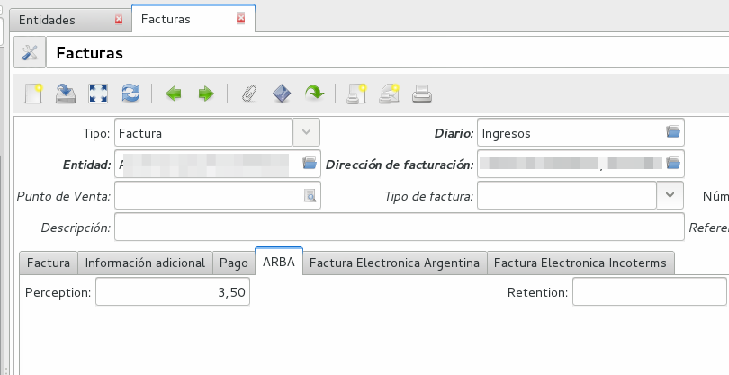

ARBA
====

Se ha desarrollado un modulo para integrar Tryton con ARBA (Agencia de Recaudación de la Provincia de Buenos Aires).
Las funcionalidades actuales son dos. 

 * Generar un informe para presentar las percepciones (RN3811).
 * Importar padron de ARBA.

Generar informe de percepciones RN 38/11
----------------------------------------

En base al instructivo de la `resolución normativa Nro 38/11 <http://www.arba.gov.ar/Apartados/Agentes/InstructivoMarcoNormativo.asp>`_, se realizó un asistente para exportar las percepciones del sistema.

.. note:: Actualmente el diseño de archivo soportado es 1.2. Percepciones Act. 7 método Percibido (quincenal) 

Importar padron de ARBA
-----------------------

Obtenga el padrón en el cual constan las alícuotas de percepción /retención de los regímenes generales, que se debe aplicar a cada contribuyente del Impuesto sobre los Ingresos Brutos especificado como así también los últimos seis padrones por sujeto. 
 
Para importar el padron, se debe configurar la clave fiscal de su usuario en *Contabilidad -> ARBA -> ARBA Configuración*. 

Realizada esta acción, puede comenzar la importarción del padrón clickeando el botón *Importar padron* en *Contabilidad -> ARBA -> ARBA Configuración*.

Cuando ver la percepción que le corresponde a una entidad, debe ir al tab *Contabilidad*.
.. image:: img/arba_entidad.png
   :width: 750 px

Cuando cargue la entidad al confeccionar una factura, se completa automáticamente, la alícuota que se le debe percibir o retener.

.. note:: El impuesto se debe cargar de forma manual, pero ya puede conocer la alícuota que corresponde percibir o retener al confeccionar la factura.

Para no tener que realizar la acción importar padron de forma manual todos los meses, el módulo ha configurado en el gestor de acciones programadas, un cron para que una vez al mes, importe las alícuotas de percepción/retención de las entidades cargadas en sus sistema.

