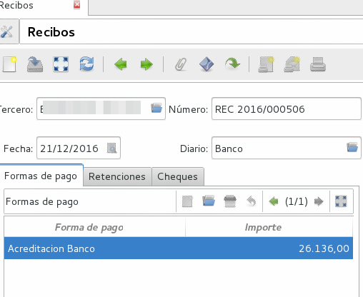
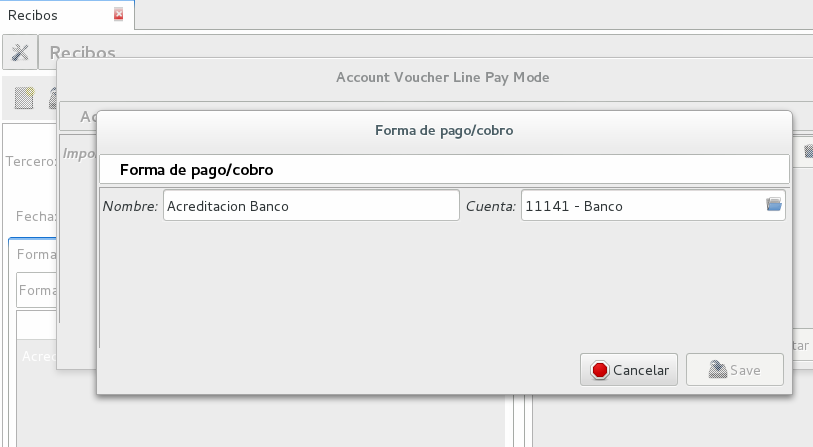
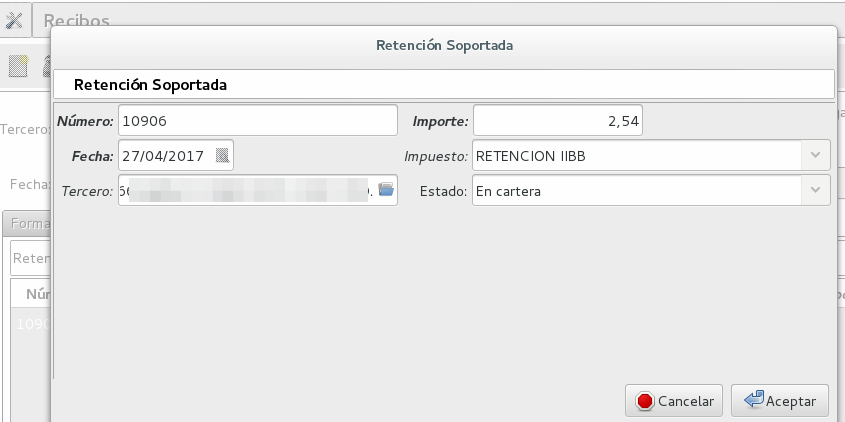
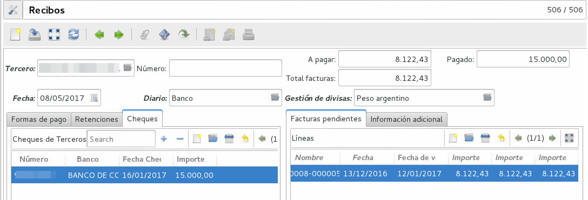
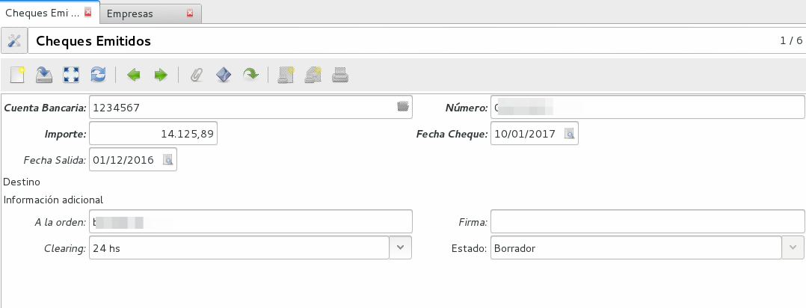

Contabilidad
============

Planes Contables
----------------
Los planes contables son editables según como lo desee el usuario. Tryton viene con un Plan Mínimo por defecto y en Argentina se desarrolló un Plan Base de empresas de servicio. A las cuentas marcadas como de Tipo Vista no se les puede generar imputaciones, sino que sirven de ordenamiento y se les puede cargar cuentas hijos.  

Ejecicio Fiscal
----------------
Ver Puesta en Marcha.

Diarios
--------
En Construcción

Comprobantes
-------------
En Argentina se desarrolló el Módulo Voucher_ar. El mismo permite crear Recibos y Pagos para registrar de forma correcta los ingresos y egresos. 
Voucher_Ar puede integrarse con el botón pagar por lo que al presionar pagar en una factura se abre la opción de voucher_ar para registrar el pago con todas sus opciones. 

Recibos:
_______
Se utiliza cuando se está cobrando una Factura, es decir, se está ingresando un Pago de Cliente. Permite registrar las distintas "Formas de Pago" que componen el pago y al mismo tiempo registar si el mismo tuvo una Retención.
Si el Recibo se genera desde la opción Pagar de una factura la misma ya viene cargada en la columna de Facturas Pendientes.
También se puede seleccionar más de una factura para cancelar varias facturas  con un pago. 
Luego es necesario escribir en Forma de Pago, para cargar de qué forma se pagó esa Factura, por ejemplo: acreditacin bancaria, contado, etc.

La forma de pago lleva un nombre y una cuenta en la que imputa:

En otra solapa se puede cargar la o las Retenciones (si existen). Las retenciones efectuadas son las realizadas poruno mismo y las soportadas son las que nos realizan.  

En el tab de cheques se permite la carga o utilización de cheques que se hayan recibido (cheques de terceros). 

De esta forma Tryton maneja la cancelación de una o varias facturas a través de una pago que puede contener distintas formas o entidades. 

Pagos:
______
Pagos: permite registrar los pagos realizados y la o las facturas que el mismo cancela. El formato de carga es igual que el de Recibos y permite el uso de los Cheques Emitidos.

.. image:: img/cheques/06_ejemplo_pago_con_cheque.png
   :width: 750 px

Configuración
_____________

 * Secuencia de pago: Se debe cargar previamente la secuencia de Pago en el año Fiscal.
 * Secuencia de recibo: Se debe cargar previamente la secuencia de Recibo en el año Fiscal.

Cheques
-------
Tryton permite el manejo de la cartera de cheques. El primer paso a realizar es configurar en la Entidad cargada como Empresa en el Sistema la cuenta bancaria donde trabajará. Debe ir a Entidades, buscar la Entidad e ingresar a la solapa Bancos y configura la cuenta bancaria.

.. image:: img/03_cuenta_bancaria_de_company.png
   :width: 750 px

También ser necesario cargar un Diario Cheques donde se llevará el registro de los mismos.

.. image:: img/cheques/01_diario_cheque.png
   :width: 750 px

En Contabilidad -> Tesorería podrá cargar y listar los cheques emitidos por la empresa como los de terceros.

Emitidos
________
En este sector podrá consignar los cheques emitidos señalando el estado del mismo. Estos cheques podrán ser utilizados para Pagos. 

Terceros
________
En este sector podrá consignar los cheques recibidos de tercero, señalando el estado del mismo. Estos cheques podrán ser utilizados o cargados desde Recibos. 

.. image:: img/cheques/05_formulario_cheque_tercero.png
   :width: 750 px

Asientos
---------
En construcción

Informes
----------

Se han creado algunos informes que sean de utilidad para la liquidación de impuestos en el sistema contable Argentino.

Subdiario de Ventas
___________________

Subdiario de Compras
____________________

RG 3885 (ex CITI)
_________________
