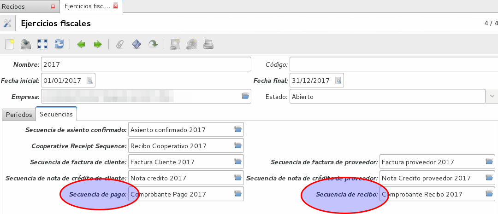
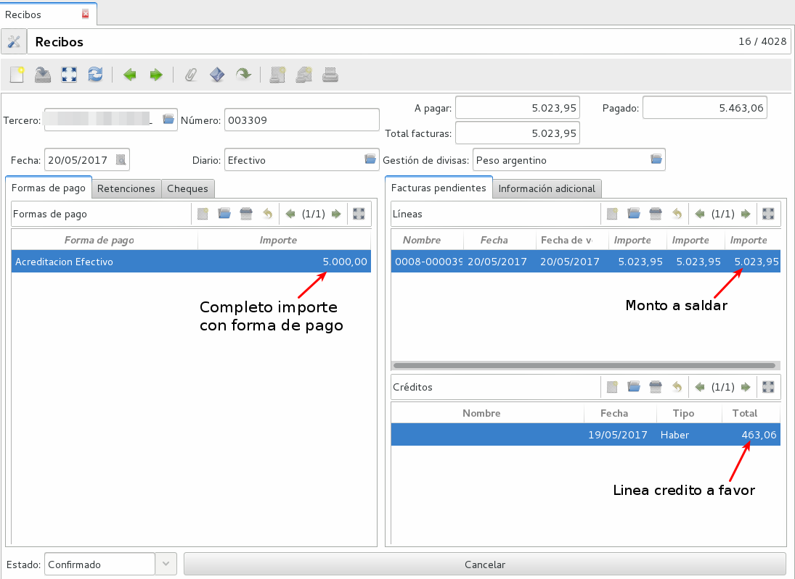
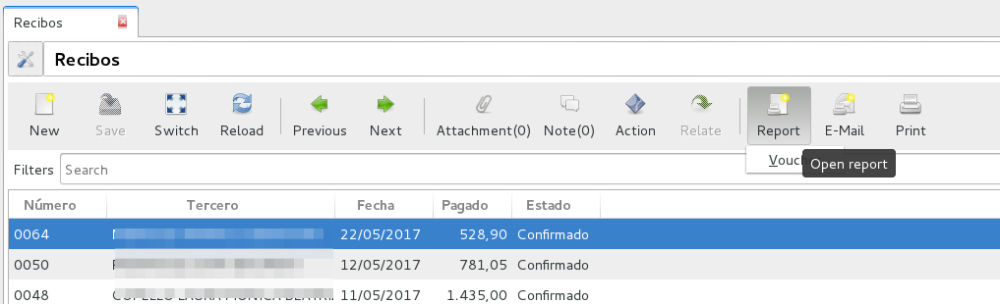
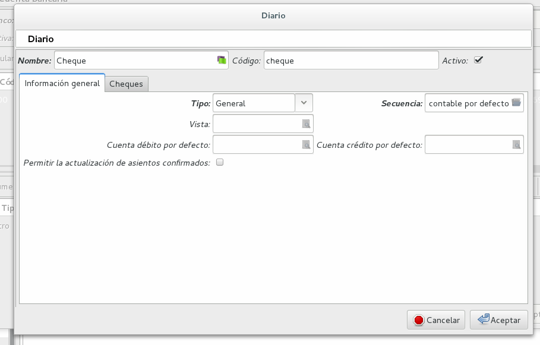
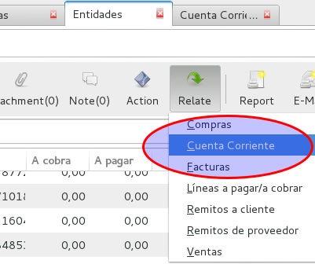

Contabilidad
============

Ejecicio Fiscal
----------------

Abrir ejercicio fiscal

El ejercicio fiscal, que por regla general suele coincidir con el año natural, tiene como función acotar el inicio y cierre de los diferentes libros que vamos a utilizar. Además limita temporalmente las anotaciones contables que podamos introducir en el sistema, de manera que hasta que no se abra el ejercicio fiscal (y los correspondientes periodos) no se podrá confirmar ninguna factura (ni ningún asiento contable) fechada en ese año. Por ejemplo, no se podrá confirmar ninguna factura fechada en el 2015 hasta que no se abra un ejercicio fiscal con Fecha inicial 01/01/2015 y Fecha final 31/12/2015.

Para abrir un ejercicio fiscal debemos dirigirnos al menú Contabilidad / Configuración / Ejercicios fiscales / Ejercicios fiscales, hacemos clic en el botón nuevo y rellenamos todos los campos obligatorios: Nombre, Fecha inicial y Fecha final. Si lo deseamos, también podemos dar un código al ejercicio fiscal, aunque este campo tiene un carácter opcional.

.. note:: Normalmente, solemos poner el año al que corresponde el ejercicio fiscal en Nombre y en Fecha inicial y Fecha final, la fecha de inicio y fin del año natural.

En la pestaña Secuencias deberemos introducir la secuencia que queramos que se utilice para los asientos y las distintas facturas confirmadas del periodo fiscal. Podemos elegir una secuencia creada previamente o crear una clicando sobre el icono Nuevo (Crear una secuencia). Es imprescindible a nivel contable que la secuencia no se repita entre distintos ejercicios fiscales, por lo que, para cada uno de los distintos ejercicios que vayamos abriendo a lo largo del tiempo, deberemos crear nuevas secuencias.

Las secuencias para las facturas de clientes y proveedor se crean utilizando la configuración del Punto de Ventas. Por defecto, en tryton, se asocian a un periodo fiscal, pero en la Argentina, las secuencias las asociaremos a un punto de venta y tipo de comprobante (ej: A, B, C, Nota de crédito, etc). En este caso, Tryton requerirá estas secuencias creadas en el sistema, pero no seran las utilizadas por la normativa de la Argentina (AFIP). Ver la documentación de Facturación para configurar el punto de venta con sus secuencias correspondientes.

Por último, debemos crear las secuencias de recibo de pagos y cobros.

Finalmente, una vez introducidos los parámetros generales y las secuencias, podemos volver a la pestaña Períodos y hacer clic en el botón Crear períodos mensuales. Con esto se nos generará un período para cada mes del año fiscal y, cuando desarrollemos nuestra actividad contable, todo asiento será siempre clasificado dentro de un período teniendo en cuenta su Fecha efectiva.

.. note:: No es recomendable utilizar períodos trimestrales porque en varios informes contables Tryton solamente nos permitirá seleccionar por períodos, y si estos son trimestrales la concreción de los informes será menor. Es preferible hacer la división por meses y si necesitamos hacer alguna declaración trimestral, tan solo tendremos que unir periodos de tres en tres.

Si esta configurando el ejercicio fiscal por primera vez, le recomendamos ver la página de *Puesta en Marcha*.

Planes Contables
----------------
Los planes contables son editables según como lo desee el usuario. Tryton viene con un Plan Mínimo por defecto y en Argentina se desarrolló un Plan Base de empresas de servicio. A las cuentas marcadas como de Tipo Vista no se les puede generar imputaciones, sino que sirven de ordenamiento y se les puede cargar cuentas hijos.  

Cuentas Contables
_________________

Una cuenta contable es el lugar donde indicamos los cambios que se producen en nuestros activos o pasivos durante un periodo concreto. Estos cambios suelen ser agrupados en distintas cuentas contables según su naturaleza, por lo que, por medio de las cuentas, podemos analizar la evolución de nuestros activos, nuestras obligaciones o las variaciones de nuestro capital. Para crear una nueva cuenta debemos dirigirnos al menú Contabilidad / Configuración / Planes contables / Cuentas / Cuentas y clickear en el botón Nuevo.

También podemos duplicar cualquier cuenta del Plan General de Contabilidad y posteriormente modificarla según nuestro intereses. (Por ejemplo buscamos la 1135 para crear la 1136)

.. note:: Hay que ir con cuidado a no duplicar cuentas de tipo vista, a menos que sepamos perfectamente lo que estamos haciendo.

En primer lugar deberemos rellenar la cabecera del formulario que se nos abrirá, indicando el Nombre y el Código de esta nueva cuenta. Si le ponemos un código numérico, el Código nos servirá para clasificar la cuenta e indicarle al sistema de qué grupos va a depender.

Una vez completada la cabecera, podemos ir rellenando el resto de campos según el carácter que le queramos dar a la nueva cuenta contable:

 * Empresa: Indicaremos para cual de nuestras empresas crearemos la cuenta.
 * Padre: En caso de que la cuenta que estamos creando dependa de otra, lo deberemos indicar aquí.
 * Clase: En este campo seleccionaremos de qué tipo será esta nueva cuenta. Si indicamos en este campo Vista le estaremos indicando al sistema que esta cuenta agrupará otras cuentas. El resto de tipologías que podemos seleccionar son: A cobrar, A pagar, Existencias, Gastos, Ingresos y Otros.
 * Cierre: Marcaremos en caso de que la cuenta sea prorrogable tras el cierre del ejercicio fiscal. Este campo nos permite indicar si el saldo de la cuenta debe ser arrastrado al período siguiente una vez cerrado el año.
 * Conciliar: En caso de que queramos que la cuenta sea conciliable.
 * Entidad requerida: Marcaremos en caso de que queramos que sea obligatorio que se indique entidad al hacer asientos. (Las cuentas de tipo *a cobrar* y *a pagar* es necesario que este dato sea seleccionado.
 * Moneda: Por defecto nos indicará la moneda configurada por defecto para la contabilidad de la empresa.
 * Moneda secundaria: Si indicamos una Moneda secundaria, cuando vayamos a ver los extractos de la cuenta que estamos creando, además de los importes con la moneda principal, nos aparecerán también una columna indicando la conversión de los importes a la Moneda secundaria seleccionada.
 * Impuestos por defecto: Seleccionaremos aquí, en caso de que queramos informar de impuestos específicos para los apuntes que se añadan a la cuenta.
 * Hijos: En caso de que queramos que otras cuentas dependan de la que estamos creando lo podremos indicar o crear otras cuentas nuevas por medio de este campo.
 * Cierres: En esta pestaña se nos irán indicando, en caso de tener marcado el tick del campo Cierre y conforme vayamos cerrando ejercicios fiscales, los importes del debe y haber del ejercicio fiscal al cierre de este.

.. note::  vez tengamos creadas las cuentas contables que necesitemos, podremos ir al menú Contabilidad / Configuración / Contable y configurar las cuentas que utilizaremos por defecto para los pagos y los ingresos.

Diarios
--------

Los libros diarios son libros donde se van estableciendo cronológicamente los registros contables que se van produciendo en nuestra empresa. Para crear uno nuevo debemos acceder por medio de la ruta Contabilidad / Configuración / Diarios / Diarios y hacer clic en el icono Nuevo.

En el formulario que se nos abrirá, deberemos seleccionar el Nombre, el Tipo, elegir qué clase de Secuencia se seguirá (podemos crear una nueva secuencia o elegir una ya creada (Crear una secuencia)), la Cuenta haber por defecto y la Cuenta debe por defecto. Además podemos elegir también si en este diario permitiremos que se cancelen asientos. Una vez rellenados los campos podremos guardar el diario y ya lo tendremos operativo para empezar a realizar apuntes contables en él.

A parte de los distintos Tipos de diario que vienen por defecto en Tryton, podemos crear nuevas tipologías según nuestras necesidades accediendo al menú Contabilidad / Configuración / Diarios / Tipos de diario y, tras clicar en Nuevo, indicar un Nombre y un Código para la nueva tipología de diario. Posteriormente, podemos modificar o crear uno o varios diarios nuevos configurándolos con la nueva tipología.

Comprobantes de pago y cobro
----------------------------
En Argentina se desarrolló el Módulo Voucher_ar. El mismo permite crear Recibos y Pagos para registrar de forma correcta los ingresos y egresos. 
Voucher_Ar puede integrarse con el botón pagar por lo que al presionar pagar en una factura se abre la opción de voucher_ar para registrar el pago con todas sus opciones. 

Configuración
_____________

Antes de utilizar el módulo, se deben crear las secuencias de pago/recibo. Esto implica que se genere automáticamente el número de comprobante en cuestión. Como la numeración de los comprobantes depende del año fiscal, las secuencias se crean desde la configuración del año fiscal correspondiente.

Ir a Contabilidad -> Configuración -> Ejercicio Fiscal

 * Secuencia de pago: Se debe cargar previamente la secuencia de Pago en el año Fiscal.
 * Secuencia de recibo: Se debe cargar previamente la secuencia de Recibo en el año Fiscal.

Al crear un nuevo comprobante, se debe seleccionar la entidad, diario y gestión de divisas. Entonces se cargaran las facturas pendientes. Si los hubiera, también se cargaran los créditos o débitos correspondientes a la entidad para poder ser utilizados en el recibo. 

Las columnas listadas en las facturas pendientes son:

 * Nombre: Número o Referencia de factura.
 * Fecha: Fecha de factura.
 * Fecha de vencimiento: La fecha según el término de pago. (Ej: si término de pago es a 30 días, entonces fecha de vencimiento será 30 días luego de la fecha de factura)
 * Importe original: El importe original de la factura.
 * Importe sin conciliar: El importe que falta saldar. Ej: Si se ha realizado un pago parcial, entonces, en esta columna aparecerá la diferencia.
 * Saldar: Importe a saldar. Esta columna es editable, y se debe cargar el saldo que se le quiere imputar a estar linea.

.. note:: Por cada factura pendiente que se desee cobrar o pagar, se debe editar la columna saldo y agregar el monto que se quiera saldar.

.. image:: img/saldar_factura.png
   :width: 750 px

Recibos de cobro
________________

Se utiliza cuando se está cobrando una Factura, es decir, se está ingresando un Pago de Cliente. Permite registrar las distintas "Formas de Pago" que componen el pago y al mismo tiempo registar si el mismo tuvo una Retención.
Si el Recibo se genera desde la opción Pagar de una factura la misma ya viene cargada en la columna de Facturas Pendientes.

También se puede seleccionar más de una factura para cancelar varias facturas  con un pago. 
Luego es necesario escribir en Forma de Pago, para cargar de qué forma se pagó esa Factura, por ejemplo: acreditacin bancaria, contado, etc.

.. image:: img/forma_de_pago/recibo_forma_de_pago.png
   :width: 750 px

La forma de pago lleva un nombre y una cuenta en la que imputa:

.. image:: img/forma_de_pago/forma_de_pago.png
   :width: 750 px

En otra solapa se puede cargar la o las Retenciones (si existen). Las retenciones efectuadas son las realizadas por uno mismo y las soportadas son las que nos realizan.  

En el tab de cheques se permite la carga o utilización de cheques que se hayan recibido (cheques de terceros). 

De esta forma Tryton maneja la cancelación de una o varias facturas a través de una pago que puede contener distintas formas o entidades. 

.. image:: img/voucher_saldar_varias_facturas_un_recibo.png
   :width: 750 px

Recibos de Pago
_______________

Pagos: permite registrar los pagos realizados y la o las facturas que el mismo cancela. El formato de carga es igual que el de Recibos y permite el uso de los Cheques Emitidos.

La entidad tiene crédito a favor
________________________________

Si la entidad tiene crédito a favor, se cargaran en la pantalla las lineas respectivas. Si desea hacer uso de ese crédito para confeccionar un recibo, debe dejar la linea en el recibo que desea que sea utilizado, agregar en la columna *saldo* el monto que esta saldando de la factura, y en forma de pago, agregar el medio de pago y monto si con el crédito a favor no alcanzase para saldar el monto que usted desea de la factura.

Imprimir comprobante de recibo/pago
___________________________________

Es usual que se desee imprimir el comprobante del recibo o pago que se confeccionó. Para realizar dicha tarea, se debe seleccionar la o los comprobantes y clickear en el botón Report.

Cheques
-------
Tryton permite el manejo de la cartera de cheques. El primer paso a realizar es configurar en la Entidad cargada como Empresa en el Sistema la cuenta bancaria donde trabajará. Debe ir a Entidades, buscar la Entidad e ingresar a la solapa Bancos y configura la cuenta bancaria.

También ser necesario cargar un Diario Cheques donde se llevará el registro de los mismos.

En Contabilidad -> Tesorería podrá cargar y listar los cheques emitidos por la empresa como los de terceros.

Emitidos
________
En este sector podrá consignar los cheques emitidos señalando el estado del mismo. Estos cheques podrán ser utilizados para Pagos. 

.. image:: img/cheques/05_formulario_cheque_emitido.png
   :width: 750 px

Terceros
________
En este sector podrá consignar los cheques recibidos de tercero, señalando el estado del mismo. Estos cheques podrán ser utilizados o cargados desde Recibos. 

Asientos
---------
En construcción

Informes Contabilidad Argentina
-------------------------------

Se han creado algunos informes adecuados a la contabilidad de Argentina, para que sean de utilidad para la liquidación de impuestos.

Cuenta corriente de una entidad
-------------------------------

Informe que muestra un resumen de cuenta cronológico de las facturación relacionada
a una entidad con sus pagos o cobros

Se debe seleccionar la entidad en el listado de entidades, luego clickear en Relacionados -> Cuenta corriente

.. image:: img/entidad_cuenta_corriente.png
   :width: 750 px

Subdiarios
__________

Una de las necesidades a la hora de hacer la liquidación de impuestos son los informes de IVA Ventas / IVA Compras.
La comunidad de Tryton Argentina, desarrolló unos informes que exportan esta información para poder ser leido por un programa de Hoja de Cálculo.

Para acceder a los informes debe ir a *Contabilidad -> Informes -> Subdiario*

Subdiario de Ventas
___________________

Informe detallado de las ventas realizadas desglosado por impuestos.
Para acceder a los informes debe ir a *Contabilidad -> Informes -> Subdiario -> Subdiario de Ventas*
Podrá encontrar 3 tipos de informes:

 * Ventas totales
 * Ventas agrupado por tipo de comprobante
 * Ventas agrupado por jurisdicción.

Subdiario de Compras
____________________

Informe detallado de las compras realizadas desglosado por impuestos.
Para acceder a los informes debe ir a *Contabilidad -> Informes -> Subdiario -> Subdiario de Compras*

RG 3885 (ex CITI)
_________________

Exporta archivos TXT para hacer la presentación de las operaciones de compra / venta.
El asistente para exportar los archivos se accede desde *Contabilidad -> Informes -> Informativo Compras y Ventas RG 3885*

La posibles al ejecutar el asistente son el periodo (año/mes) y si desea en formato CSV o no.

.. note:: La opción *formato CSV* esta pensada para que el archivo que genera sea *leído* por una persona humana y abierto por un programa como Calc (libreoffice). Pero para hacer la importación en el módulo Compras y Ventas del SIAP, esa opción debe estar destildada.
