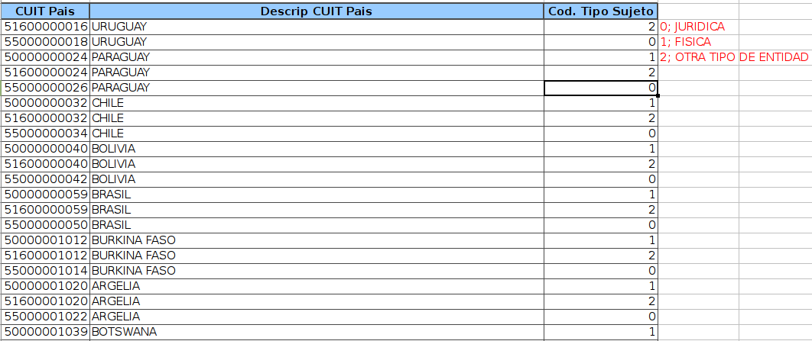
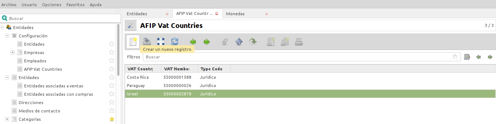
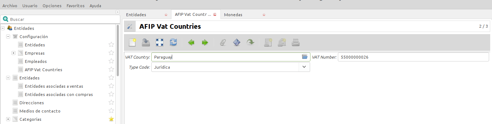
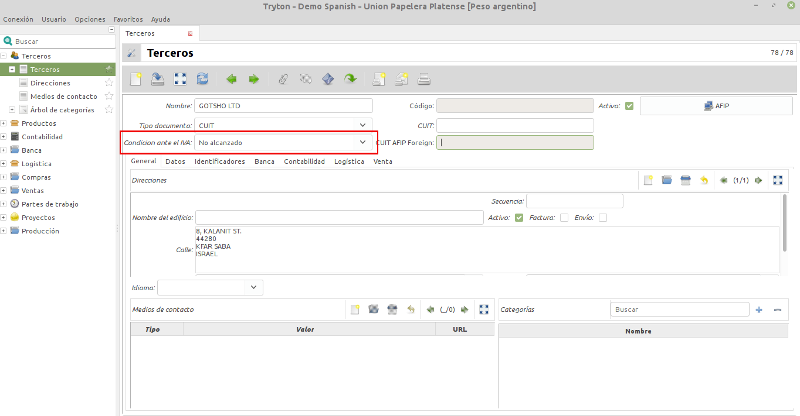
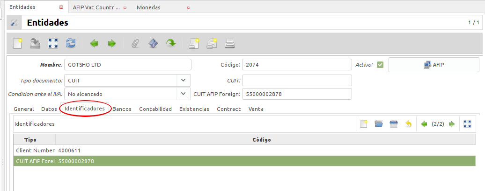
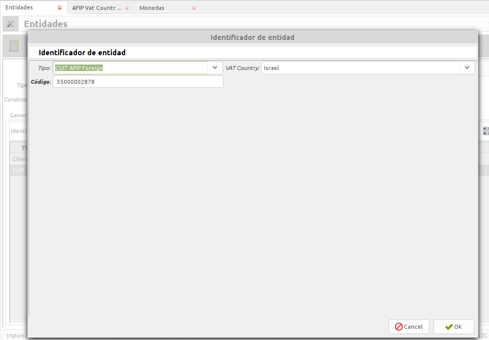

Entidades
=========

Configurar empresa:
-------------------
Para operar es necesario tener una empresa configurada (crear Entidad de la empresa). En la configuración se configura si se utilizará el webservice de la AFIP de factura electronica. Puede marcar contra qu servicio apunta (homologación o producción) y las llaves de conexión.

Entidades:
----------

Para operar con Tryton se cargarán Entidades, es decir, clientes y proveedores (en Tryton la empresa también estará cargada como Entidad). 

.. image:: img/entidad.png
   :width: 750 px
   
En la mayoría de las instalaciones es necesario agregar, quitar o modificar datos de la Entidad para adaptar el sistema al esquema de datos de la Empresa. En principio los datos obligatorios están señalados al igual que en el resto del sistema y se permite la carga de datos relacionados con la entidad como ser: Direcciones y Medios de Contacto.
Más allá de los datos básicos será necesario cargar los datos contables de la entidad, Tryton realiza la validación de CUIT de Argentina y otros países de forma automática.      
Además Tryton permite configurar si la Entidad imputará contablemente a las cuentas por defecto o a una cuenta particular para la entidad (más allá de esto realiza los saldos de cuenta). 

.. image:: img/entidadcontabilidad.png
   :width: 750 px

Se realizó una pestaña "Empresa" para cargar datos de utilidad de las Empresas para la Argentina, como ser Tipo de compañía, IIBB y códigos de activad AFIP entre otros datos.

.. image:: img/entidadempresa.png
   :width: 750 px

Desde el símbolo que es una flecha (ver imagen) se puede acceder a los registros relacionados, como por ejemplo acceder de forma sencilla a las facturas de un cliente o proveedor.

.. image:: img/entidadacciones.png
   :width: 750 px    

Tryton maneja un completo árbol de categorías para poder realizar una correcta segmentación de los registros. 
Al igual que en otros módulos se pueden realizar búsquedas por distintos filtros y extraer de forma sencilla los resultados de una búsqueda (copiar y pegar listado en una planilla de cálculo). 

Carga de Entidades Extranjeras
------------------------------
La carga de entidades extranjeras se realiza primero ingresando en ENTIDADES/CONFIGURACIÓN/EMPRESAS/AFIP VAT COUNTRIES, donde cargaremos el Nº de CUIT especial que la AFIP designa a las entidades extranjeras. Dependiendo al país que pertenezcan tendrán un número determinado que puede verificarse en la web de la AFIP.

Ejemplos:

Debemos proceder haciendo click en "CREAR UN NUEVO REGISTRO".

Se abrirá una nueva ventana donde completaremos los siguientes campos:
1) En "VAT Country" cargaremos el país correspondiente a la entiedad.
2) En "VAT Number" irá el Nº de CUIT especial designado por la AFIP.
3) Y en "Type Code", debemos elegir si se trata de una entidad FÍSICA, JURIDICA o DE OTRO TIPO.
Finalizaremos guardando el registro. 

   
Luego iremos a ENTIDADES/CONFIGURACIÓN/ENTIDADES/NUEVO REGISTRO y haremos la carga de la entidad extranjera completando los campos de forma similar a los casos de entidades comunes. Sólo debemos tener en cuenta dos particularidades:

-En "CONDICIÓN FRENTE AL IVA" se deberá elegir la opción "NO ALCANZADO". 

-Mientras que en el campo "CUIT AFIP FOREIGN", deberemos completar con el Nº de CUIT especial que la AFIP designó a la entidad extranjera. Para ello, debemos ir a la solapa "IDENTIFICADORES", haremos click en "NUEVO REGISTRO" y cargaremos los datos de la siguiente manera:
-Tipo: elegimos la opción "CUIT AFIP Foreign"
-VAT Country: elegimos el país que corresponda.
-Código: completamos con el Nº de CUIT especial designado por la AFIP al país que elegimos anteriormente. 

Validar Datos en AFIP
---------------------

Se realizó la integración con el servicio de la AFIP que permite traer datos de la Entidad de forma automática. Al poner el número de CUIT y presionar el botón AFIP el sistema consulta en el momento el webservices de la AFIP y trae los datos que la misma informa.  
