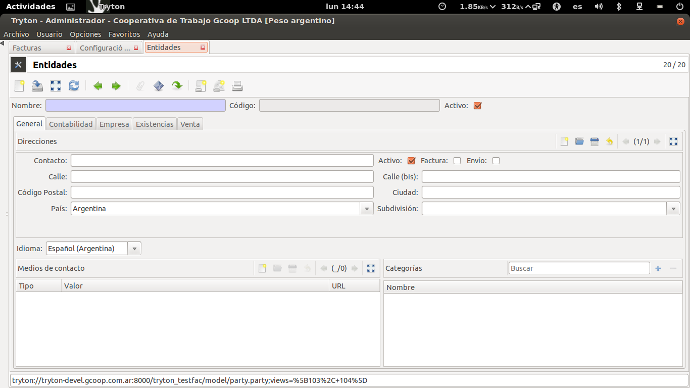
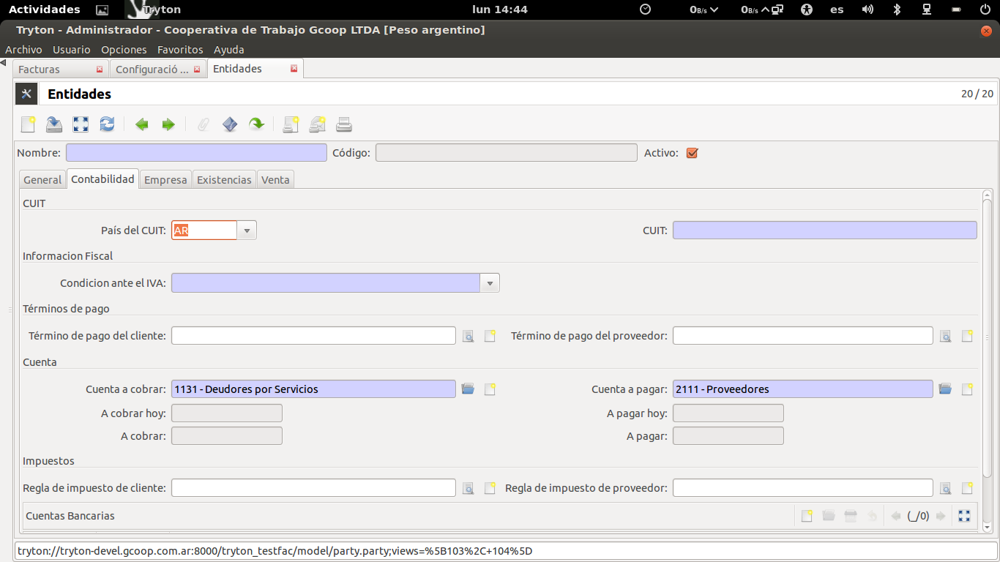
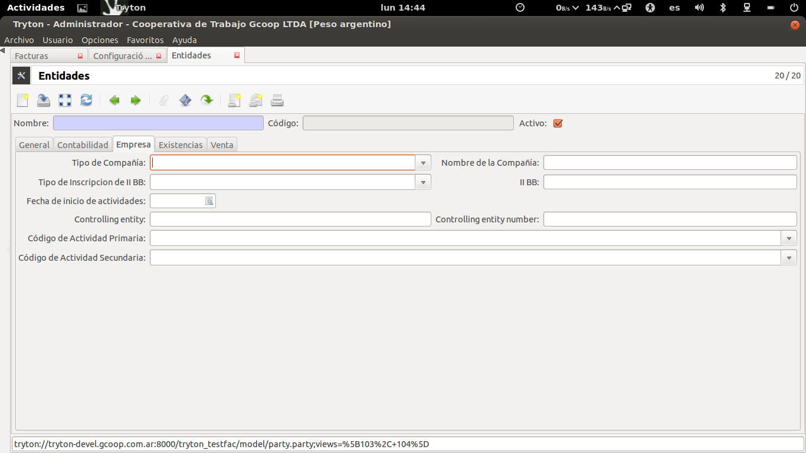
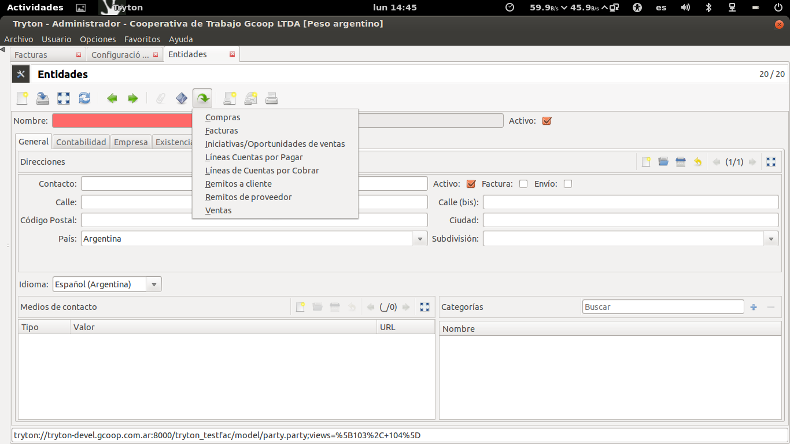

Entidades
=========

Para operar con Tryton se cargarán Entidades, es decir, clientes y proveedores (en Tryton la empresa también estará cargada como Entidad). 

   
En la mayoría de las instalaciones es necesario agregar, quitar o modificar datos de la Entidad para adaptar el sistema al esquema de datos de la Empresa. En principio los datos obligatorios están señalados al igual que en el resto del sistema y se permite la carga de datos relacionados con la entidad como ser: Direcciones y Medios de Contacto.
Más allá de los datos básicos será necesario cargar los datos contables de la entidad, Tryton realiza la validación de CUIT de Argentina y otros países de forma automática.      
Además Tryton permite configurar si la Entidad imputará contablemente a las cuentas por defecto o a una cuenta particular para la entidad (más allá de esto realiza los saldos de cuenta). 

Se realizó una pestaña "Empresa" para cargar datos de utilidad de las Empresas para la Argentina, como ser Tipo de compañía, IIBB y códigos de activad AFIP entre otros datos.

Desde el símbolo que es una flecha (ver imagen) se puede acceder a los registros relacionados, como por ejemplo acceder de forma sencilla a las facturas de un cliente o proveedor.

Tryton maneja un completo árbol de categorías para poder realizar una correcta segmentación de los registros. 
Al igual que en otros módulos se pueden realizar búsquedas por distintos filtros y extraer de forma sencilla los resultados de una búsqueda (copiar y pegar listado en una planilla de cálculo). 

Validar Datos en AFIP
---------------------

Se realizó la integración con el servicio de la AFIP que permite traer datos de la Entidad de forma automática. Al poner el número de CUIT y presionar el botón AFIP el sistema consulta en el momento el webservices de la AFIP y trae los datos que la misma informa.  
