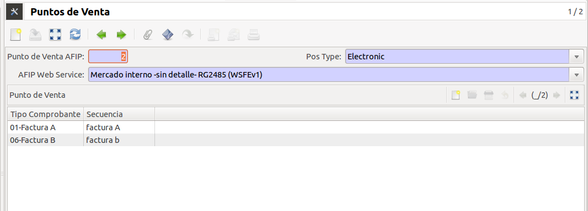
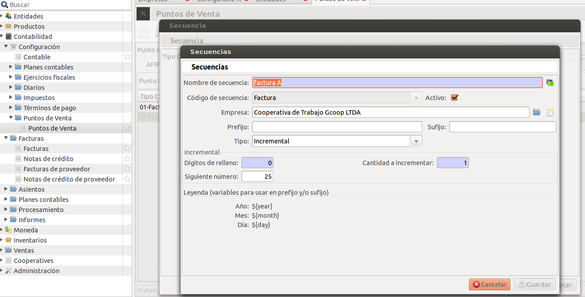
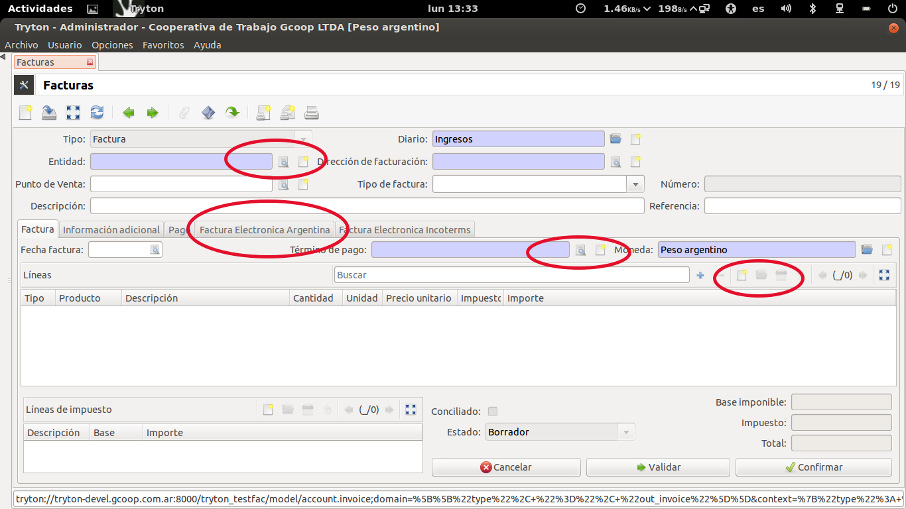
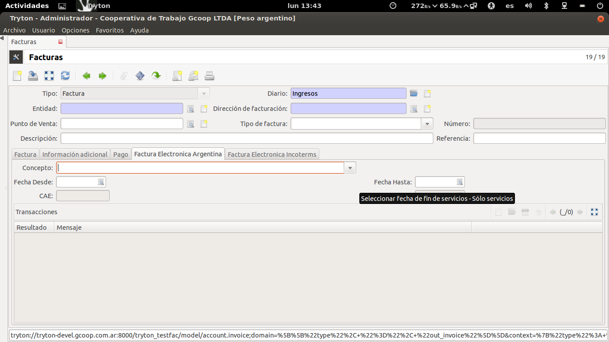
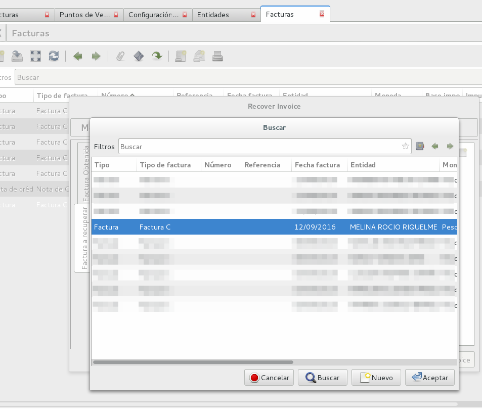
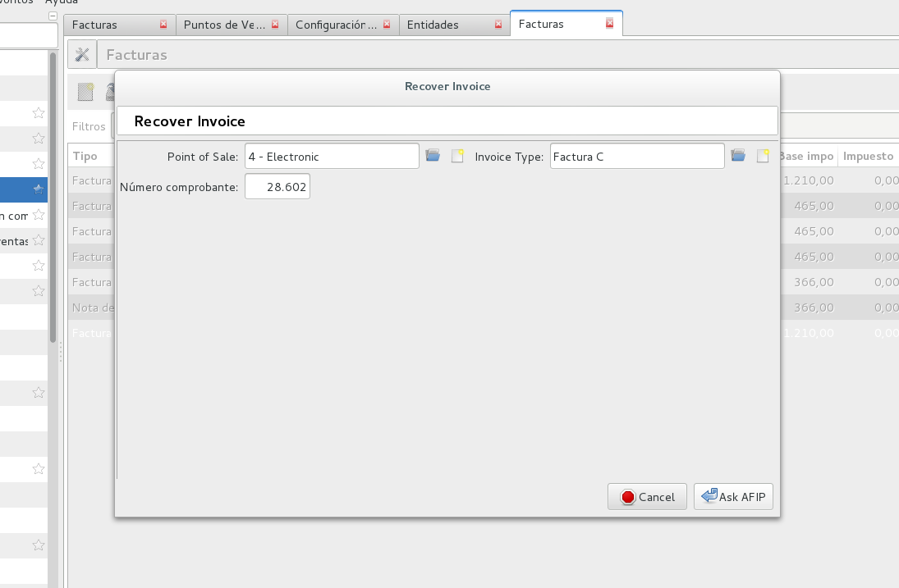
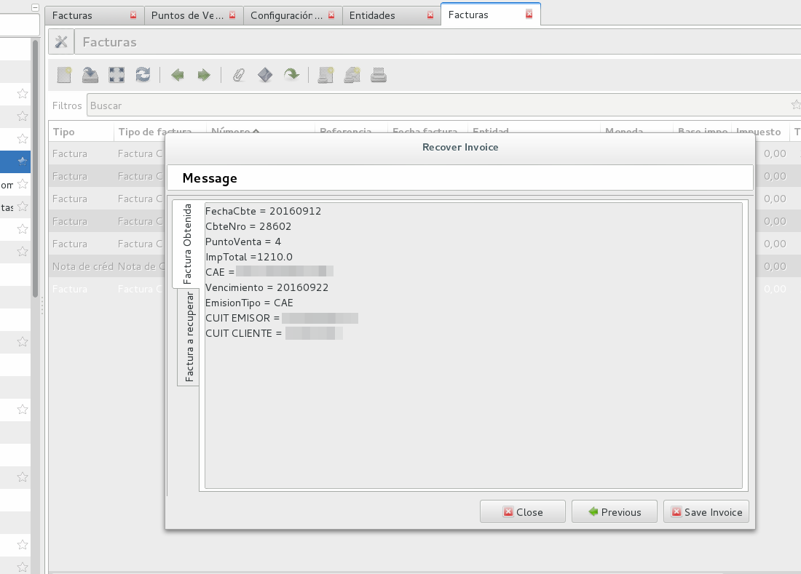
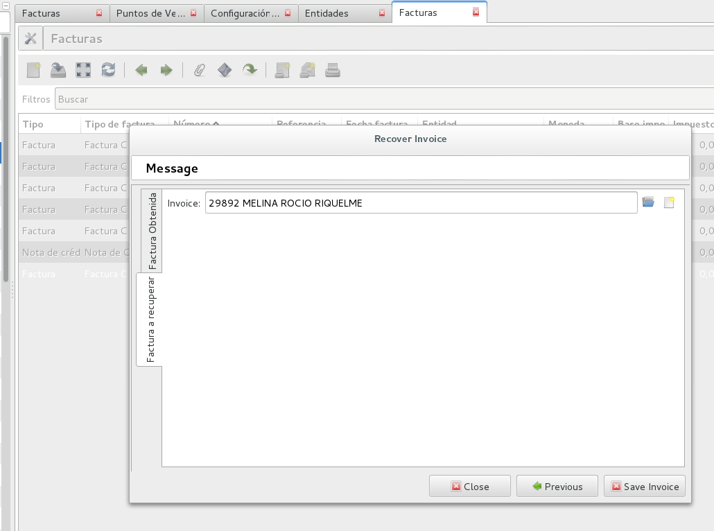
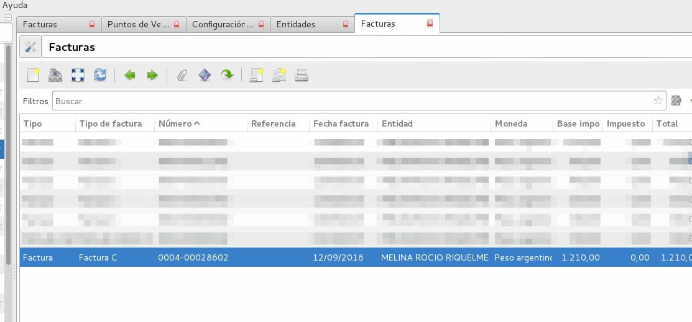

Facturación
===========

Se detalla a continuación la facturación para la Argentina y en particular la facturación electrónica contra la AFIP.

Configurar Punto de Venta
-------------------------
Según las reglas de facturación de la Argentina existen distintos Puntos de Ventas, lo cuales pueden ser: Manuales, Electrónicos o Tickeadora Fiscal.
Es por eso que antes de facturar se deben configurar los puntos de venta. 
Esto supone marcar qué tipo de Punto de venta es y qué facturas emite el mismo (A, B, C, etc.). 

A cada una de las facturas que se configuren se les deberá crear una secuencia para señalar la numeración que llevará ese tipo de factura en ese punto de venta específico.

En el caso de querer realizar facturas manuales se podrá modificar el template .odt de factura para generar la factura según la factura pre impresa que tenga la empresa.
El template de facturas viene armado para tomar los datos que devuelve la AFIP en la generación de facturas electrónicas lo que permite imprimir facturas válidas.
 
Para poder realizar la facturación es importante tener bien configurada la Empresa: cargar certificados de AFIP para la facturación electrónica, la condición ante el IVA y el CUIT y el logo de la misma (usado en la factura).
También se deberá cargar de forma correcta el cliente (CUIT y tipo de IVA).

Factura de cliente
------------------
Una vez configurado un Punto de Venta se puede proceder a facturar. Para el caso de facturar de forma electrónica será necesario contar con acceso Internet.
Para conformar una factura será necesario Contar con: una Entidad, un término de pago y comenzar a llenar las lineas de la factura. 
Si el usuario tiene permiso, al igual que en los otros módulos de Tryton, el usuario podrá crear todas estos datos en el momento mismo de crear una factura.
 

Factura Electrónica
-------------------
En el caso de tratarse de una factura electrónica será necesario completar los datos que la AFIP solicita, es decir, ver si se trata de un Producto o Servicio y en este caso especificar las fechas del mismo. 
 

En el sector de transacciones se podrán ver los mensajes de las comunicaciones realizadas con la AFIP. 
 
Una vez completados los datos necesario para la factura se podrán realizar las acciones de validar o  confirmar la factura (según los permisos del usuario). Es la acción de confirmar que realiza la comunicación con la AFIP (caso de factura electrónica) y que inmuta todos los campos dejando la factura lista para realizar el pago.
 

Tryton maneja otras formas para la generación de tickets rápido (ver tryton pos). 
   
Recuperar Factura
-----------------

El módulo "Recuperar Factura" es una funcionaldiad para factura electrónica de la AFIP. Se utiliza ante cortes de conectividad al realizar una (o varias) facturas. Permite consultar en la AFIP por un numero de factura para ver si la misma existe en la AFIP y en caso de ser necesario traer los datos de la AFIP y agregarlos a una factura que quedó mal confeccionada.

En este caso, la factura quedará en estado borrador en nuestro sistema.

Para poder pasarla a estado confirmado y guardar los datos de AFIP (CAE y fecha vencimiento CAE), utilizaremos el asistente de Recuperar Factura. Este asistente se ejecuta desde el botón de lanzar acciones en la sección de Facturas.

Cuando se ejecuta el asistente, debemos primer consultar en AFIP el número de comprobante que estamos queriendo recuperar. Para ello, completamos los datos de punto de venta, tipo de comprobante, y número de comprobante.

Al consultar, nos traerá una pantalla con los datos de la factura confirmada en AFIP. Debemos ir a la pestaña *factura a recuperar* y buscar la factura que queremos pasar a estado confirmada y guardar los datos de AFIP.

Realizada la acción de guardar factura, podemos comprobar que se le ha asignado su número de comprobante correspondiente y la ha pasado a estado confirmada (y obviamente creado el asiento contable).

Facturas de Proveedor
---------------------
En el apartado Facturas de Proveedor podrá cargar las facturas de sus proveedores. Al crear un nuevo registro, la facturá se encontrará en estado *Borrador* con lo cual, usted puede modificar todos sus datos, luego al completar todos los datos, debe pasarla a estado *Confirmado* para que genere los asientos contables en el sistema y repercute en los informes (Subdiario IVA Compras, CITI RG3685, etc).

El sistema, ya viene cargado con los impuestos de IVA compras. Si usted debe cargar una factura de proveedor donde se perciben impuestos de IIBB, entonces debe crear los impuestos de IIBB de Compras y luego agregar el impuesto a la factura de forma manual. En el siguiente apartado daremos un ejemplo de cada.

Primero debe ir al apartado: Contabilidad -> Facturas -> Facturas de proveedor y crear un nuevo registro.

Cabecera de factura
___________________

La factura contiene un sector de cabecera donde se destacan ciertos campos a completar:

 * Entidad: La entidad (proveedor) si no se encuentra puede cargarla desde aquí. En la entidad debe cargar el CUIT/DNI.
 * Referencia: Se debe cargar punto de venta y número de comprobante de la factura del proveedor. Se debe cargar con 4 dígitos para el punto de venta y 8 para el número de comprobante (completando con ceros a la izquierda) y agregando el caracter guión (-) entre ambos. Un ejemplo sería: 0001-00001211.
 * Descripción: Información sobre la compra.
 * Comprobante: Tipo de comprobante de la factura. `Tabla de comprobantes AFIP <https://www.afip.gob.ar/fe/documentos/TABLACOMPROBANTES.xls>`_
 * Fecha de factura: La fecha de la factura.
 * Término de pago: Debe ser creado con anterioridad, o puede crearlo desde aquí.
   Tener en cuenta que este dato es utilizado por si usted ha definido pagarle a su proveedor por ejemplo a 15 días o al Contado.
 * Moneda: Utilizará por defecto la moneda con la que esta definida su compañia (Peso Argentino), pero si esta cargando una factura de proveedor del exterior, entonces debe cambiar la Moneda (ej: USD).

 (captura de pantalla de carga de factura)

Lineas de factura
_________________

.. note:: Si usted lo desea, para facilitar la carga, puede cargarle a su sistema los productos de compras. De esa manera, ya estará parametrizando algunos datos para no tener que cargarlos cada vez que hace una compra por el mismo producto/servicio.

Veremos que tenemos la pestaña General. Debemos seleccionar *tipo: Linea*

 * Producto: Si ya tuviera un producto de compras, lo debe seleccionar. Haciendo esto, se cargará automáticamente (si el producto ya ha sido parametrizado correctamente) el impuesto de compra (ej: IVA 21% de Compras) y la Cuenta contable a la que va a imputar.

 * Descripción: Información sobre el producto u/o servicio que esta comprando.
 * Tipo de producto: Información para ser cargada en el subdiario de compras.
 * Cantidad: Cantidades del producto a comprar.
 * Unidad de medida: Probablemente la mayoría de las veces utilice *Unidad*. Sino, puede seleccionar otro tipo de unidad de medida, (ej: Kilogramos)
 * Precio unitario: Si estamos seleccionando un producto, cargará este dato automáticamente.
 * Importe: Se actualizará automáticamente utilizando los datos de precio unitario y cantidad.
 * Impuestos: Si esta linea de factura esta gravada, aquí debe cargar el impuesto o impuestos en cuestión (Ej: IVA 21% Compras).

 (captura de pantalla de linea)

.. note:: Si la linea en cuestión no esta gravada, entonces no se le debe cargar el impuesto. Luego en el SUBDIARIO de Compras se informará este importe en una columna separada.

 (captura de pantalla de subdiario)

Cargar impuesto de forma manual
_______________________________

Un ejemplo de una carga de dicho impuesto sería IIBB. Para hacer la carga de este impuesto,
debe ir la sección de impuestos de la factura y agregar un nuevo registro.
Tener en cuenta que como va a tener que cargar la base imponibe del impuesto, es importante que esta información sea la última en ser cargada.

 * Impuesto: Si no lo tiene cargado, debe cargar el impuesto y la tasa de ratio en cuestión. Es importante que al cargar un impuesto nuevo, siempre le cargue el grupo de impuestos en cuestión.
 * Descripción: información del impuesto. Si esta utilizando un impuesto ya cargado, se completará automáticamente.
 * Cuenta: Cuenta a la que imputa el impuesto (ej: IVA Crédito Fiscal). Este dato se trae del impuesto automáticamente.
 * Base: Se debe cargar el importe de la base imponible.
 * Importe: Si el impuesto es de tipo porcentaje, se completara solo. Si es de tipo fijo, usted debe cargar el importe del impuesto.

(captura de pantalla del cuadro de impuestos)

(captura de pantalla de carga del impuesto manual)

(captura de pantalla de carga de un impuesto)

Terminada la carga de la factura, puede pasar este registro a estado Confirmada. En el apartado de Contabilidad -> Comprobantes puede obtener información sobre como cargar el pago de una factura de proveedor.
