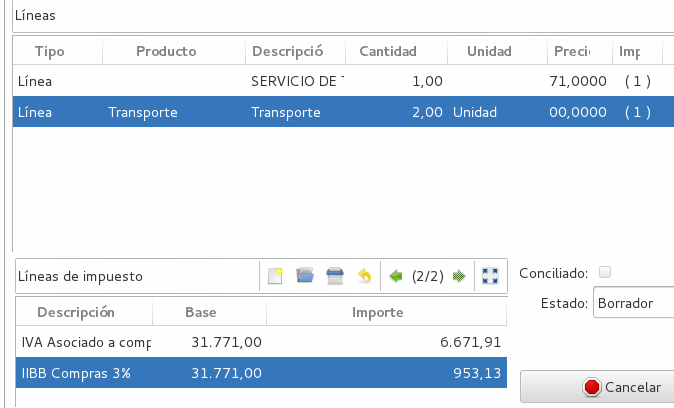

Facturación
===========

Se detalla a continuación la facturación para la Argentina y en particular la facturación electrónica contra la AFIP.

Desde Contabilidad / Facturas podremos gestionar toda la facturación de nuestra empresa, tanto las facturas que emitimos a nuestros clientes, como las que nos emiten nuestros proveedores, ya que el sistema distingue entre distintos tipos de facturas dependiendo de si se generan por una venta, una compra o por una devolución de estas. Desde el menú de facturación podremos acceder a cualquiera de los tipos de factura:

 * Facturas de cliente
 * Facturas de proveedor

Para cada una de las distintas tipologías, el funcionamiento que encontraremos será el mismo: Podremos encontrar la factura en distintos estados dependiente de en qué punto se encuentre el proceso de facturación. Los estados en lo que podremos encontrar una factura son:

    Borrador: Será el estado en el que se genere la factura y el único en el que se permita su edición, por lo que mientras factura se encuentre en este estado podremos modificar cualquier campo que deseemos (excepto el campo Número que se rellenará automáticamente cuando confirmemos la factura). Cuando ya tengamos todos los campos rellenados podremos modificar el estado de la factura clicando en el botón Validar o en el botón Confirmar.

    Si la factura se genera desde una venta, esta también se creará en estado Borrador con todos los campos rellenados según la información de la venta, por lo que en este caso, tan solo tendremos que comprobar que los datos son correctos y Validar o Confirmar la factura.

    Validada: Cuando validamos una factura, la edición de los campos se bloquea y el sistema ya no nos permite modificarla. Aun así, podemos cambiar el estado de nuevo a Borrador en cualquier momento para hacer alguna modificación. El estado validado no genera ningún asiento contable, es lo que también se conoce como factura pro forma. Hay que tener en cuenta que no es un paso previo al estado Confirmado, solo un estado en el que puede estar la factura antes de ser confirmada, si no trabajamos con Facturas pro forma podemos confirmar la factura directamente desde el estado Borrador.

    Confirmada: Una vez confirmemos la factura, el sistema automáticamente le dará un número y la contabilizará generando un asiento contable en nuestro registro. Este es un paso definitivo y una vez esté la factura confirmada no se podrá volver a cambiar de estado y, por lo tanto, tampoco se podrá modificar. La factura quedara registrada en el sistema AFIP.

    Pagada: La factura pasará a estado Pagada cuando le indiquemos al sistema que se ha realizado el pago. Para ello tendremos dos formas: si el pago de esta factura se hace en efectivo, clicaremos en el botón Pagar, y se generará un asiento conciliando los apuntes de pago con los generados por la factura; en caso de que el pago se realice por cualquier otro método, cuando conciliemos los apuntes generados por la factura, el sistema reconocerá que esta ha sido pagada y su estado cambiará a Pagada. En Argentina se ha desarrollado el módulo comprobantes de recibos/pagos para facilitar el pago de facturas utilizando los distintos medios de (efectivo, transferencia, cheques, etc).

Configurar Punto de Venta
-------------------------
Según las reglas de facturación de la Argentina existen distintos Puntos de Ventas, lo cuales pueden ser: Manuales, Electrónicos o Tickeadora Fiscal.
Es por eso que antes de facturar se deben configurar los puntos de venta. 
Esto supone marcar qué tipo de Punto de venta es y qué facturas emite el mismo (A, B, C, etc.). 

.. image:: img/detallepuntodeventa.png
   :width: 750 px

A cada una de las facturas que se configuren se les deberá crear una secuencia para señalar la numeración que llevará ese tipo de factura en ese punto de venta específico.

.. image:: img/secuenciafactura.png
   :width: 750 px

En el caso de querer realizar facturas manuales se podrá modificar el template .odt de factura para generar la factura según la factura pre impresa que tenga la empresa.
El template de facturas viene armado para tomar los datos que devuelve la AFIP en la generación de facturas electrónicas lo que permite imprimir facturas válidas.
 
Para poder realizar la facturación es importante tener bien configurada la Empresa: cargar certificados de AFIP para la facturación electrónica, la condición ante el IVA y el CUIT y el logo de la misma (usado en la factura).
También se deberá cargar de forma correcta el cliente (CUIT y tipo de IVA).

Configuración de Punto de Venta Electrónico
-------------------------------------------
Para crear un punto de venta electrónico en la AFIP debemos utilizar el regímen de “Emisión de Comprobantes Electrónicos" (R.E.C.E.): el mismo permite autorizar Facturas A y B para Responsables Inscriptos mediante Web Services, aplicativo AFIP SIAP RECE o servicio por clave fiscal "Comprobantes en linea" (máximo 100 comprobantes). De esta manera, la gestión del CAE se hace en forma automatizada, es decir, el computador del contribuyente se comunica automáticamente con el servidor de AFIP, el que procesa la solicitud de autorización y comunica la aprobación (el CAE), por el mismo medio (Internet), y se integra también automáticamente al comprobante, que en ese momento queda válidamente emitido.

Para configurar el punto de venta electrónico para el uso de nuestro ERP, debemos seguir los siguientes pasos:

1) Ir a la página web de la AFIP. En "INGRESO CON CLAVE FISCAL", completar con nuestro Nº de CUIT y contraseña

2) Luego, iremos a "Administración de puntos de venta y domicilios"

   
3) Seleccione el contribuyente con el que desea facturar electrónicamente

   
4) Luego elija “A/B/M de puntos de venta”
 
 .. image:: img/pdv3.png
   :width: 750 px
 
5) A continuación aparecerá una ventana emergente aclaratoria de los "Sistemas de Facturación Asociados a los Puntos de Ventas" que puede utilizar. En nuestro caso, debe ser "RECE para aplicativo y web services".
 
 .. image:: img/pdv4.png
   :width: 750 px
   
6) Luego hará click en "AGREGAR" y completará de la siguiente manera:
*Número: 1001
*Nombre fantasía: FACTURACIONWEB
*Sistema: “RECE para aplicativo y web services o “Factura Electrónica - Monotributo - Web Services”
*Nuevo domicilio: elija el correspondiente. 

   

   
Y por último acepte y confirme las veces que sean necesarias.

7) Ahora deberá "VINCULAR EL SERVICIO". Para ello, debe SALIR y volver a ingresar a la web de la AFIP. Haga click en "Administrador de Relaciones de Clave Fiscal".

   
8) Seleccione el contribuyente con el que desea facturar electrónicamente

   
9) Elija “Nueva Relación”

   
10) Presione “Buscar”

   
11) Seleccione el cuadro “AFIP” y luego seleccione la opción “WebServices”

   
12) Busque y seleccione el cuadro “Facturación Electrónica”

   
13) Seleccione “Buscar” en el renglón de "Representante"

   
14) Coloque el Nº de CUIT de quien será su proveedor ante AFIP. Por último seleccione “Buscar”

   
15) Luego acepte y confirme las veces que sean necesarias

Factura de cliente
------------------
Una vez configurado un Punto de Venta se puede proceder a facturar. Para el caso de facturar de forma electrónica será necesario contar con acceso Internet.
Para conformar una factura será necesario Contar con: una Entidad, un término de pago y comenzar a llenar las lineas de la factura. 
Si el usuario tiene permiso, al igual que en los otros módulos de Tryton, el usuario podrá crear todas estos datos en el momento mismo de crear una factura.
 
.. image:: img/factura.png
   :width: 750 px

Factura Electrónica
-------------------

Previamente a la carga de una factura "E" debemos ingresar en el módulo MONEDA/MONEDAS. Allí buscaremos las monedas correspondientes a la venta que estamos realizando y cargaremos las tasas de cambio.
Ejemplo Dolar estadounidense-Peso argentino:

.. image:: img/moneda1.png
   :width: 750 px

.. image:: img/moneda2.png
   :width: 750 px

De esta manera, los asientos contables quedan en pesos utilizando como dato de tasa de cambio lo que se configuró a la moneda peso argentino. La moneda referencia vale 1 y el peso lo que diga el mercado.

Una vez configurada la moneda, procederemos a hacer la factura.

En el caso de tratarse de una factura electrónica será necesario completar los datos que la AFIP solicita, es decir, ver si se trata de un Producto o Servicio y en este caso especificar las fechas del mismo. 

.. image:: img/afipfactura.png
   :width: 750 px

IMPORTANTE
Cuando hagamos una factura "E" a un cliente extranjero debemos completar correctamente los siguientes campos:

-En PUNTO DE VENTA: se deberá elegir "3-Electronic", es decir, el utilizado para los casos de exportación.
-En "MONEDA", completaremos el cambio acordado con el comprador. Ej. Dólar estadounidense, Real, Boliviano, Euro, etc.

   

   
-Y en la solapa FACTURA ELECTRÓNICA INCOTERMS: se debe elegir la opción "FREE ON BOARD".

En el sector de transacciones se podrán ver los mensajes de las comunicaciones realizadas con la AFIP. 
 
Una vez completados los datos necesario para la factura se podrán realizar las acciones de validar o  confirmar la factura (según los permisos del usuario). Es la acción de confirmar que realiza la comunicación con la AFIP (caso de factura electrónica) y que inmuta todos los campos dejando la factura lista para realizar el pago.
 
.. image:: img/afipfactura.png
   :width: 750 px

Tryton maneja otras formas para la generación de tickets rápido (ver tryton pos). 
   
Recuperar Factura
-----------------

El módulo "Recuperar Factura" es una funcionaldiad para factura electrónica de la AFIP. Se utiliza ante cortes de conectividad al realizar una (o varias) facturas. Permite consultar en la AFIP por un numero de factura para ver si la misma existe en la AFIP y en caso de ser necesario traer los datos de la AFIP y agregarlos a una factura que quedó mal confeccionada.

En este caso, la factura quedará en estado borrador en nuestro sistema.

Para poder pasarla a estado confirmado y guardar los datos de AFIP (CAE y fecha vencimiento CAE), utilizaremos el asistente de Recuperar Factura. Este asistente se ejecuta desde el botón de lanzar acciones en la sección de Facturas.

Cuando se ejecuta el asistente, debemos primer consultar en AFIP el número de comprobante que estamos queriendo recuperar. Para ello, completamos los datos de punto de venta, tipo de comprobante, y número de comprobante.

.. image:: img/02-asistente-buscar-factura.png
   :width: 750 px

Al consultar, nos traerá una pantalla con los datos de la factura confirmada en AFIP. Debemos ir a la pestaña *factura a recuperar* y buscar la factura que queremos pasar a estado confirmada y guardar los datos de AFIP.

.. image:: img/03-asistente-comprobar-factura.png
   :width: 750 px

Realizada la acción de guardar factura, podemos comprobar que se le ha asignado su número de comprobante correspondiente y la ha pasado a estado confirmada (y obviamente creado el asiento contable).

.. image:: img/05-factura-confirmada.png
   :width: 750 px

Facturas de Proveedor
---------------------
En el apartado Facturas de Proveedor podrá cargar las facturas de sus proveedores. Al crear un nuevo registro, la facturá se encontrará en estado *Borrador* con lo cual, usted puede modificar todos sus datos, luego al completar todos los datos, debe pasarla a estado *Confirmado* para que genere los asientos contables en el sistema y repercute en los informes (Subdiario IVA Compras, CITI RG3685, etc).

El sistema, ya viene cargado con los impuestos de IVA compras. Si usted debe cargar una factura de proveedor donde se perciben impuestos de IIBB, entonces debe crear los impuestos de IIBB de Compras y luego agregar el impuesto a la factura de forma manual. En el siguiente apartado daremos un ejemplo de cada.

Primero debe ir al apartado: Contabilidad -> Facturas -> Facturas de proveedor y crear un nuevo registro.

Cabecera de factura
___________________

La factura contiene un sector de cabecera donde se destacan ciertos campos a completar:

 * Entidad: La entidad (proveedor) si no se encuentra puede cargarla desde aquí. En la entidad debe cargar el CUIT/DNI.
 * Referencia: Se debe cargar punto de venta y número de comprobante de la factura del proveedor. Se debe cargar con 4 dígitos para el punto de venta y 8 para el número de comprobante (completando con ceros a la izquierda) y agregando el caracter guión (-) entre ambos. Un ejemplo sería: 0001-00001211.
 * Descripción: Información sobre la compra.
 * Comprobante: Tipo de comprobante de la factura. `Tabla de comprobantes AFIP <https://www.afip.gob.ar/fe/documentos/TABLACOMPROBANTES.xls>`_
 * Fecha de factura: La fecha de la factura.
 * Término de pago: Debe ser creado con anterioridad, o puede crearlo desde aquí.
   Tener en cuenta que este dato es utilizado por si usted ha definido pagarle a su proveedor por ejemplo a 15 días o al Contado.
 * Moneda: Utilizará por defecto la moneda con la que esta definida su compañia (Peso Argentino), pero si esta cargando una factura de proveedor del exterior, entonces debe cambiar la Moneda (ej: USD).

Lineas de factura
_________________

.. note:: Si usted lo desea, para facilitar la carga, puede cargarle a su sistema los productos de compras. De esa manera, ya estará parametrizando algunos datos para no tener que cargarlos cada vez que hace una compra por el mismo producto/servicio.

Veremos que tenemos la pestaña General. Debemos seleccionar *tipo: Linea*

 * Producto: Si ya tuviera un producto de compras, lo debe seleccionar. Haciendo esto, se cargará automáticamente (si el producto ya ha sido parametrizado correctamente) el impuesto de compra (ej: IVA 21% de Compras) y la Cuenta contable a la que va a imputar.

 * Descripción: Información sobre el producto u/o servicio que esta comprando.
 * Tipo de producto: Información para ser cargada en el subdiario de compras.
 * Cantidad: Cantidades del producto a comprar.
 * Unidad de medida: Probablemente la mayoría de las veces utilice *Unidad*. Sino, puede seleccionar otro tipo de unidad de medida, (ej: Kilogramos)
 * Precio unitario: Si estamos seleccionando un producto, cargará este dato automáticamente.
 * Importe: Se actualizará automáticamente utilizando los datos de precio unitario y cantidad.
 * Impuestos: Si esta linea de factura esta gravada, aquí debe cargar el impuesto o impuestos en cuestión (Ej: IVA 21% Compras).

.. note:: Si la linea en cuestión no esta gravada, entonces no se le debe cargar el impuesto. Luego en el SUBDIARIO de Compras se informará este importe en una columna separada.

Observar la columna *No gravado* donde aparece el importe de la linea en cuestión.

Cargar impuesto de forma manual
_______________________________

Un ejemplo de una carga de dicho impuesto sería IIBB. Para hacer la carga de este impuesto,
debe ir la sección de impuestos de la factura y agregar un nuevo registro.
Tener en cuenta que como va a tener que cargar la base imponibe del impuesto, es importante que esta información sea la última en ser cargada.

 * Impuesto: Si no lo tiene cargado, debe cargar el impuesto y la tasa de ratio en cuestión. Es importante que al cargar un impuesto nuevo, siempre le cargue el grupo de impuestos en cuestión.
 * Descripción: información del impuesto. Si esta utilizando un impuesto ya cargado, se completará automáticamente.
 * Cuenta: Cuenta a la que imputa el impuesto (ej: IVA Crédito Fiscal). Este dato se trae del impuesto automáticamente.
 * Base: Se debe cargar el importe de la base imponible.
 * Importe: Si el impuesto es de tipo porcentaje, se completara solo. Si es de tipo fijo, usted debe cargar el importe del impuesto.

Se puede ver que las lineas de factura tiene asociado un solo impuesto, y la factura tiene cargado dos impuestos. Uno por el IVA (que se asocian a las lineas factura) y el de IIBB que se ha cargado de forma manual.

Luego en el subdiario de compras tendremos la liquidación del impuesto de IIBB por provincia.

Terminada la carga de la factura, puede pasar este registro a estado Confirmada. En el apartado de Contabilidad -> Comprobantes puede obtener información sobre como cargar el pago de una factura de proveedor.

Notas de Crédito y Débito
-------------------------

Notas de Crédito
________________

Una nota de crédito es un documento oficial que cancela una factura, en este sentido la misma debe ser realizada desde la factura de cliente que se desea anular o modificar (no se deben generar las notas de crédito como una factura independiente).

Se debe presionar sobre a la acción (imagen de rombo) Abonar para iniciar el armado de una Nota de Crédito. Si se tilda la opción Cón Devolución, Tryton realiza la devolucin de mercancia (si existe) y cancela completamente la factura y realiza el asiento correspondiete. Pasará ambos comprobantes a estado Pagado.

Caso contrario la devolución es parcial (destildar Con Devolución). En este caso se genera una Nota de Crédito en estado Borrador que debe ser editada y llevada a confirmar. 
Para que ambos comprobantes se concilien automáticamente como lo realiza el asistente, se debe ejecutar el Asistente de *Conciliación de cuentas*. 

Ir a Contabilidad -> Procesamiento -> Conciliar cuentas. Al ejecutar dicho asistente, recorrerá las entidades en búsqueda de montos que no han sido conciliados. Se deben pintar las lineas que se deseen conciliar y clickear en el botón *Conciliar*. Realizada esta acción, ambos comprobantes pasaran a estado pagado.

Notas de Débito
________________
Para el caso de la Nota de Débito se debe presionar Crear Factura de Cliente y elegir el tipo de comprobante Nota de Débito. 

