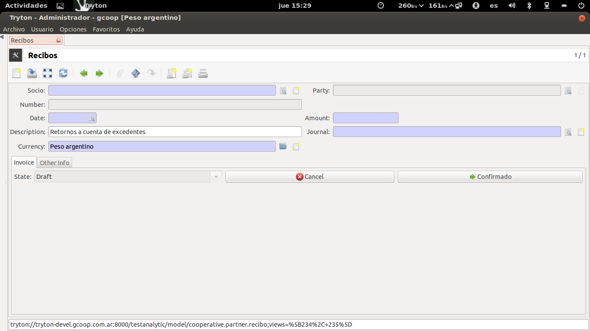
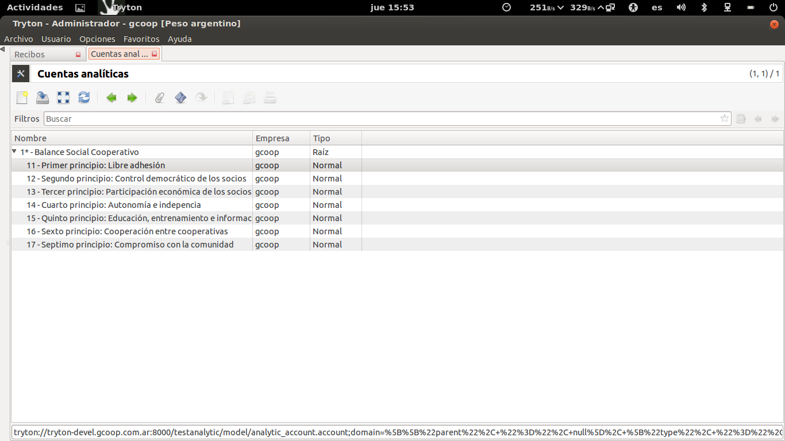
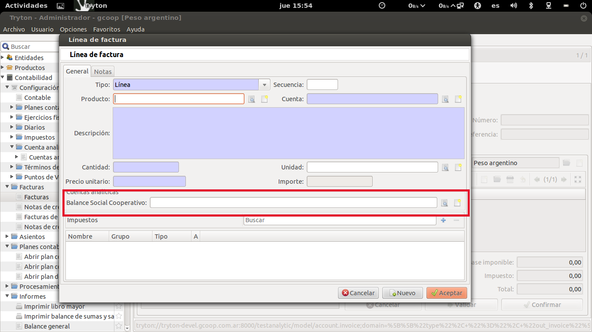
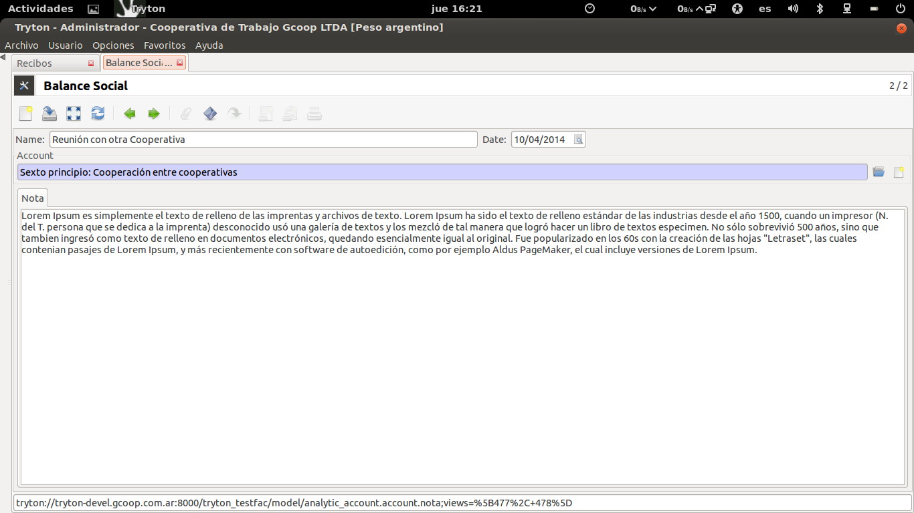
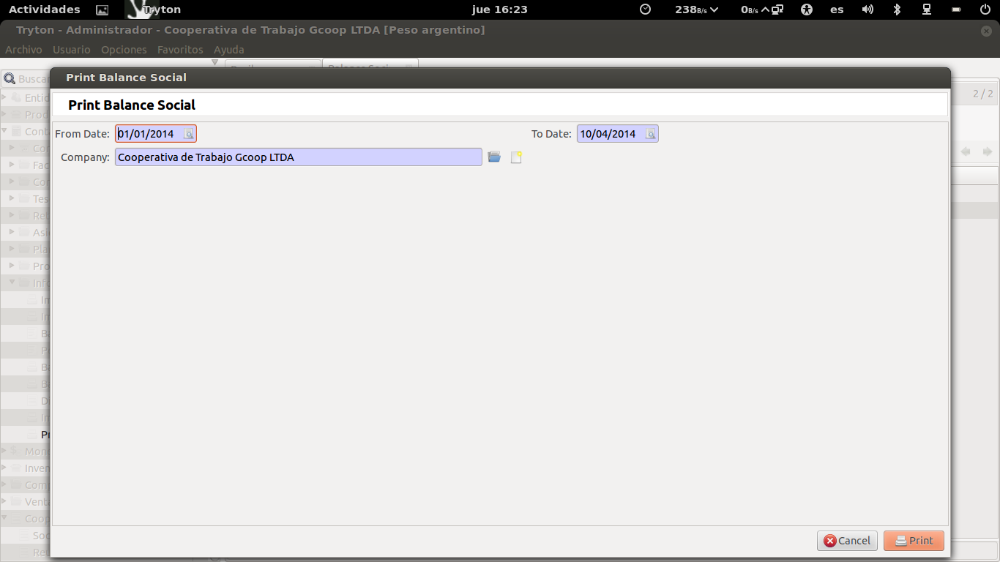

Gestión Cooperativa
===================

El Módulo copperative_ar contiene una serie de módulos para llevar adelante la gestión de una Cooperativa de Trabajo:

 * Socios
 * Reuniones
 * Sanciones
 * Vacaciones / licencias
 * Recibos
 * Balance Social Cooperativo

Socios
------

Este módulo permite la carga de datos útiles del socio. Primero que nada el socio debe ser creado como Entidad, dado que ahí se cargarán los datos contables necesarios para que se opere en el sistema.
Desde el módulo Socio se selecciona al Socio (ya cargado como Entidad) y se cargan los datos complementarios de utilidad legal (legajo, estado, fecha de ingreso, etc.).

.. image:: img/socio.png
   :width: 750 px

Este módulo permitirá entonces tener el legajo del socio dentro del sistema. Este módulo está relacionado con el resto y es por eso que pueden visualizarse: las reuniones en las que el socio participó, sus recibos de Adelanto de Excedentes, las Sanciones y las vacaciones del mismo.

Vacaciones
----------

El módulo se puede utilizar creando nuevos registros desde el módulo o desde la pestaña de "vacaciones y licencias" que se visualiza en la edición de cada Socio.   

.. image:: img/vacaciones.png
   :width: 750 px
   
Permite cargar los días que tiene asignados ese socio (Días de vacaciones) y luego permite cargar un registro por cada licencia o vacación que el socio se tome. 

.. image:: img/cargavacacion.png
   :width: 750 px

Sanciones
---------

Este módulo permite cargar sanciones a un socio con los Tipos que figuran en el Estatuto base de una Cooperativa de Trabajo: Llamado de Atención, Apercibimiento y Exclusión con el causante yel descargo presentado por el socio.
  
.. image:: img/sancion.png
   :width: 750 px

Reuniones
---------

Aqui se podrán cargar las Reuniones de Consejo y Asambleas que realiza la cooperativa, señalando los socios presentes y los temas tratados como área de texto o archivo adjunto (Tipos de Reunión: reunión de consejo, Asamblea 
Ordinaria o Extraordinaria).

.. image:: img/reuniones.png
   :width: 750 px

Desde el socio se puede buscar una Reunión para señalar que el socio participó en la misma.

Recibos
-------

Permite crear el "Recibo de Anticipo de Retornos a Cuenta de Excedentes" que los socios de las cooperativas de trabajo reciben como prestación del trabajo que realizan.

   
Este módulo permite cargar el Socio, importe y la fecha del retiro y el diario sobre el que se imputará. Se genera un Recibo con un completo Workflow de trabajo. El sistema toma los datos de al Cooperativa y del socio de forma automática para generar la impresión del recibo de forma correcta. 
El recibo nace en borrador, pasa a estar inmutado una vez que está confirmado (tiene una secuencia propia de Recibos) y genera el asiento con la deuda y el mismo queda pendiente de pago.
Una vez que el mismo se paga queda terminado el proceso y se realiza el Asiento correspondiente. Toda la información contable es accesible desde el recibo.

.. image:: img/detallerecibo.png
   :width: 750 px  

El sistema está preparado para recibir la importación de datos de recibos para generar los mismos de forma automática. Se utiliza la importación del sistema y son necesarios los campos obligatorios del módulo (con documento del socio). Campos:
Amount,Company,Currency,Journal,Date,Socio. 

Balance Social Cooperativo
--------------------------

El desarrollo de Balance Social Cooperativo le permite a la cooperativa cargar las actividades realizadas y valorizar actividades con impacto social que de otra manera quedan invisibilizadas en un Balance Contable. El reporte de Balance Social Cooperativo puede servir como información interna de la cooperativa o como insumo para la generación del Balance Social Cooperativo que de forma anual puede hacer la cooperativa. 
En tanto no existe un único módelo de Balance Social Cooperativo, el desarrollo realizado permite cargar y generar un informe con datos útiles sobre la gestión de la cooperativa.
Para más información sobre Balance Social Cooperativo puede verse la información disponible en la Alianza Cooperativa Internacional 
http://www.aciamericas.coop/Balance-Social-Cooperativo-2394

El desarrollo realizado se basa en toda la potencialidad y flexibilidad que brinda el concepto de Contabilidad Analítica propio del ERP. En este sentido lo que se agrega es un esqueleto para las cuentas analíticas bases de un Balance Social Cooperativo (los siete principios cooperativos como cuentas analíticas). Utilizar el concepto de cuentas 

   
Los módulos Tryton: "Analytic Invoice", "Analytic Purchase" y "Analytic Sale" permiten entonces que toda compra o venta (o desde Facturas) puedan ser imputadas no solo a las cuentas contables sino también a las cuentas analíticas del Balance Social Cooperativo.
            

Por ejemplo una compra realizada a una cooperativa puede imputarse al principio 6 "Cooperación entre cooperativas". Esto nos permite ir registrando y valorizar en la gestión cotidiana el trabajo social de la cooperativa.
Por otro lado se desarrolló un módulo que permite cargar Notas que se asocian a las lineas analíticas del Balance Social Cooperativo. Esto permite llevar una memoria narrativa de las actividades realizadas por la cooperativa.  

Toda la información que se genera tanto desde la imputación analítica al Balance Social Cooperativo de los movimientos contables como las notas cargadas al sistema forman parte del Informe Balance Social Cooperativo que se exporta en formato editable.

La exportación permite seleccionar el rango de fechas deseado y la empresa (es multiempresa) sobre la que se quiere generar el informe. El Balance Social Cooperativo contiene además una serie de datos útiles sobre la gestión de la cooperativa durante el período seleccionado. 
Se exporta el listado de Socios, la composición por Sexo, el listado de altas y bajas, la cantidad de reuniones realizadas y la presencia de los socios en las mismas.
   
