.. TrytonArDocumentacion documentation master file, created by
   sphinx-quickstart on Tue Feb 11 11:57:59 2014.
   You can adapt this file completely to your liking, but it should at least
   contain the root `toctree` directive.
   

Contents:

.. toctree::
   :maxdepth: 2

Introducción
============

Tryton es un completo sistema de gestión de empresas/organizaciones (ERP) de licencia libre que cubre las necesidades de las áreas de contabilidad, ventas, compras, almacén, inventario, proyectos, entre muchas otras.
Tryton es un proyecto nacido en Bélgica y Francia a partir del proyecto TinyERP, y cuenta con una amplia red de desarrolladores en España y otros países de Europa y América Latina. 
Se basa en tecnología Python/XML trabajando sobre una base de datos PostgreSQL lo que lo hace altamente escalable, seguro y customizable.
Tryton se organiza en una arquitectura de tres capas: El cliente Tryton, el servidor Tryton y la Base de datos. La plataforma junto con los módulos oficiales están cobijados por la licencia GPLv3.

Pensando en las necesidades de las cooperativas se desarrolló un sistema de gestión para facilitar el manejo diario de la información administrativa y contable de las mismas adaptado a la legislación argentina. 

Todas las pruebas y desarrollos fueron realizados utilizando el servidor y cliente Linux. 

Desarrollado para Tryton 3.0

Descripción funcional general
=============================

El sistema Tryton es un sistema ERP multiempresa que permite la gestión de los procesos administrativos dentro de la empresa.

En lineas generales el Software permite:

   * Creación y Gestión de Entidades (Clientes / Proveedores)
   * Gestión de Productos
   * Contabilidad
   * Divisas
   * Inventarios
   * Compras
   * Ventas
    
Tryton permite la gestión de diversos roles y permisos para cada uno de los módulos.

Instalación
===========
Para la instalación de Tryton verificar la documentación oficial en:
http://doc.tryton.org/3.0/tryton/doc/installation.html

Para la instalación del módulo account_invoice_ar, leer INSTALL del módulo 
(https://github.com/tryton-ar/account_invoice_ar/blob/master/INSTALL) 

Producción: El módulo pyafipws

Entendiendo el sistema
======================

.. image:: img/ingresotryton.png
   :width: 750 px
   
Una vez que se ha ingresado al sistema con los datos del servidor, base de datos y usuario y contraseña Tryton presenta una pantalla dividida en dos sectores y un menú superior de navegación.

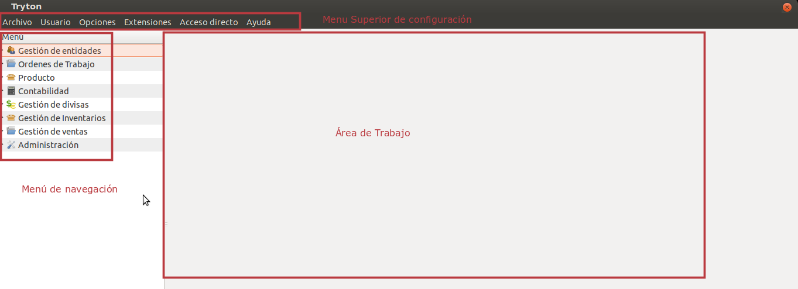
   
El menú de navegación le permite recorrer los diversos módulos del sistema a los que tiene acceso.

El área de trabajo es donde el usuario podrá alternar la vista de lista con la vista de creación y edición con el fin de realizar diversas acciones dentro del sistema.

Al escribir en un campo si se presiona la tecla TAB el sistema buscará auto completar con registros que ya estén cargados en el sistema. Si no el usuario podrá buscar el registro (lupa) o crear un nuevo registro. Esto posibilita que desde un módulo se acceda a otros módulos del sistema facilitando su uso. 
Desde la creación de una factura uno puede crear entidades, productos, etc. desde un mismo lugar.

En el sector superior el símbolo de herramienta nos permite desplegar un menú con diferentes acciones que podremos realizar como por ejemplo eliminar el registro sobre el que estamos posicionados. Muchas de las acciones se pueden realizar desde otros atajos que el sistema dispone para facilitar la navegación.

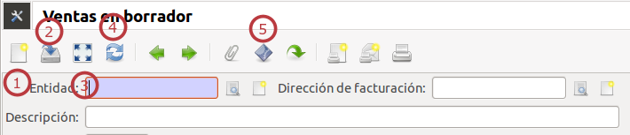

El menú superior se presenta en todos los módulos de manera similar y nos permite, crear nuevos registros en el módulo (1), guardar el registro (2), cambiar entre la vista de lista y la de edición (3), recargar el registro (4) y lanzar acciones (5).

Puesta en marcha
================

Para poder completar estas operaciones el sistema requiere la configuración de diversas cuentas de imputación de los movimientos que genera el sistema, como se detalla a continuación. 
Se realizó un video tutorial donde pueden seguirse los pasos básicos de configuración del sistema para su uso: 
http://www.youtube.com/watch?v=nnJIJFD7lrc

Alta Período Fiscal
-------------------

Crear Período Fiscal: Contabilidad → Ejercicios Fiscales.
Permite crear el anual, las secuencias y hacer meses o trimestres, de forma 
manual o con wizard.
Es necesario porque toda imputación se realiza a un período fiscal. Es necesario cargar todas las secuencias aunque luego se configuren secuencias para cada tipo de factura en los puntos de venta.

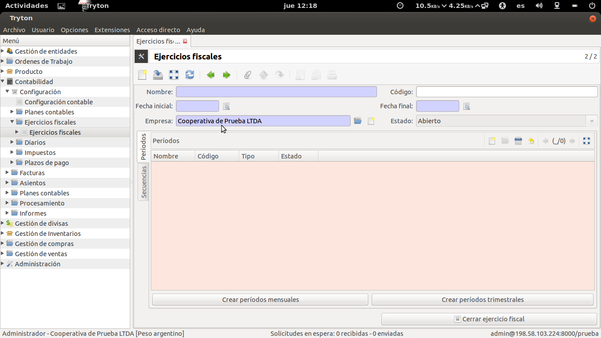

Plan de Cuentas
---------------

El plan de cuentas se selecciona con el Asistente de Configuración que se corre la primera vez que se ingresa al sistema. 
Es por eso que es importante tener  el módulo account_ar o account_coop_ar en la instalación para poder seleccionarlo. De todas formas desde Contabilidad → Configuración → Planes Contables se puede cargar un plan contable desde plantilla o agregar - modificar las cuentas que se desee. 

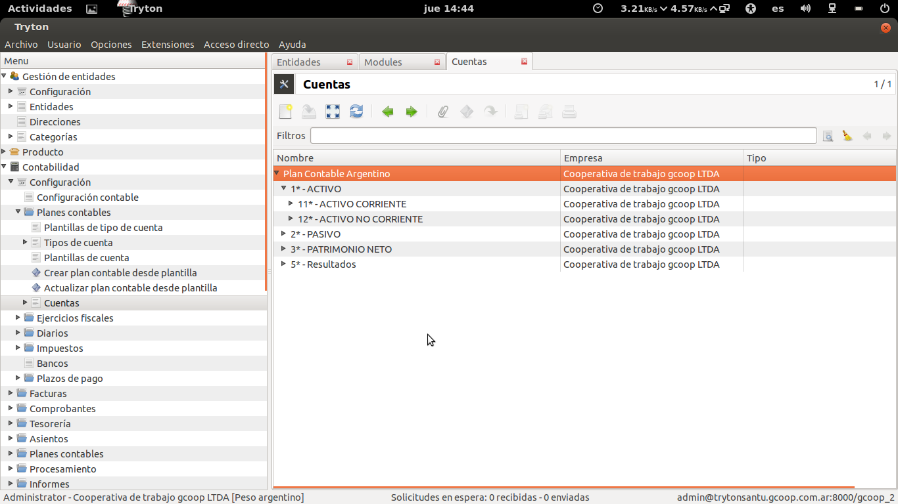

Alta de Empresa
---------------

El alta de empresa se realiza desde el Asistente que corré la primera vez que se confiugura el sistema y puede agregarse y modificarse información desde Entidades -> Configuración -> Empresas.

Con el módulo account_invoice_ar se podrá observar una pestaña dentro de Empresa que permite la carga de los certificados para interactuar con los Webservcices de la AFIP.

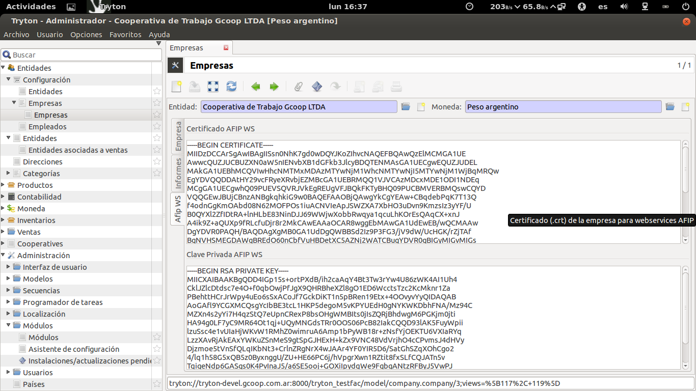

Por otro lado es imporatnte notar que una empresa es una entidad, por lo que se podrán cargar datos de la entidad necesarios para el armado de las facturas y otros usos dentro del sistema. En la entidad se puede visualizar una pestaña Empresa que permite cargar información fiscal e impositiva. 
Además en la pestaña Contabilidad será necesario cargar la condición frente al IVA. Tryton ya trae por default la validación del CUIT de Argentina.

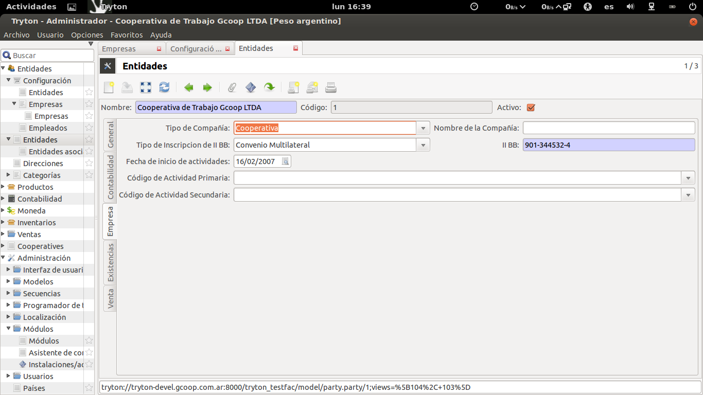
   
Al realizar el alta de un cliente / proveedor también será necesario cargar el CUIT y la condición ante el IVA para poder generar facturas.    

Facturación
===========

Se detalla a continuación la facturación para la Argentina y en particular la facturación electrónica contra la AFIP.

Configurar Punto de Venta:
--------------------------
Según las reglas de facturación de la Argentina existen distintos Puntos de Ventas, lo cuales pueden ser: Manuales, Eletrónicos o Tickeadora Fiscal.
Es por eso que antes de facturar se deben configurar los puntos de venta. 
Esto supone marcar qué tipo de Punto de venta es y qué facturas emite el mismo (A, B, C, etc.). 

.. image:: img/detallepuntodeventa.png
   :width: 750 px

A cada una de las facturas que se configuren se les deberá crear una secuencia para señalar la numeración que llevará ese tipo de factura en ese punto de venta específico.

.. image:: img/secuenciafactura.png
   :width: 750 px

En el caso de querer realizar facturas manuales se podrá modificar el template .odt de fatcura para generar la factura según la factura pre imrpesa que tenga la empresa.
El template de facturas viene armado para tomar los datos que devuelve la AFIP en la generación de facturas electrónicas lo que permite imprimir facturas válidas.
 
Para poder realizar la facturación es importante tener bien configurada la Empresa: cargar certificados de AFIP para la facturación electrónica, la condición ante el IVA y el CUIT y el logo de la misma (usado en la factura).
También se deberá cargar de forma correcta el cliente (CUIT y tipo de IVA).

Gestión Cooperativa
===================

El Módulo copperative_ar contiene una serie de módulos para llevar adelante la gestión de una Cooperativa de Trabajo:

 * Socios
 * Reuniones
 * Sanciones
 * Vacaciones / licencias
 * Recibos

Socios
------

Este módulo permite la carga de datos útiles del socio. Primero que nada el socio debe ser creado como Entidad, dado que ahi se cargarán los datos contables necesarios para que se opere en el sistema. 
Desde el módulo Socio se selecciona al Socio (ya cargado como Entidad) y se cargan los datos complementarios de utilidad legal (legajo, estado, fecha de ingreso, etc.).

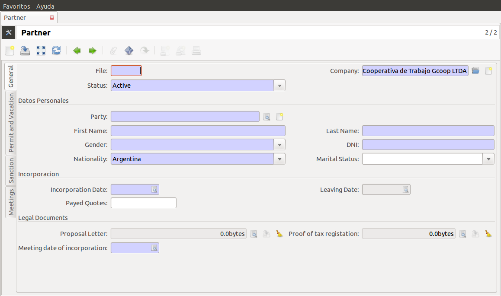

Este módulo permitirá entonces tener el legaajo del socio dentro del sistema. Este módulo está relacionado con el resto en tanto pueden visualizarse: las reuniones en las que el socio participó, sus recibos de Adelanto de Excedentes, las Sanciones y las vacaciones del mismo.

Vacaciones
----------

El módulo puede utilizarsecreando nuevos registros desde el módulo o desde la pestaña de "vacaciones y licencias" que se visualiza en la edición de cada Socio.   

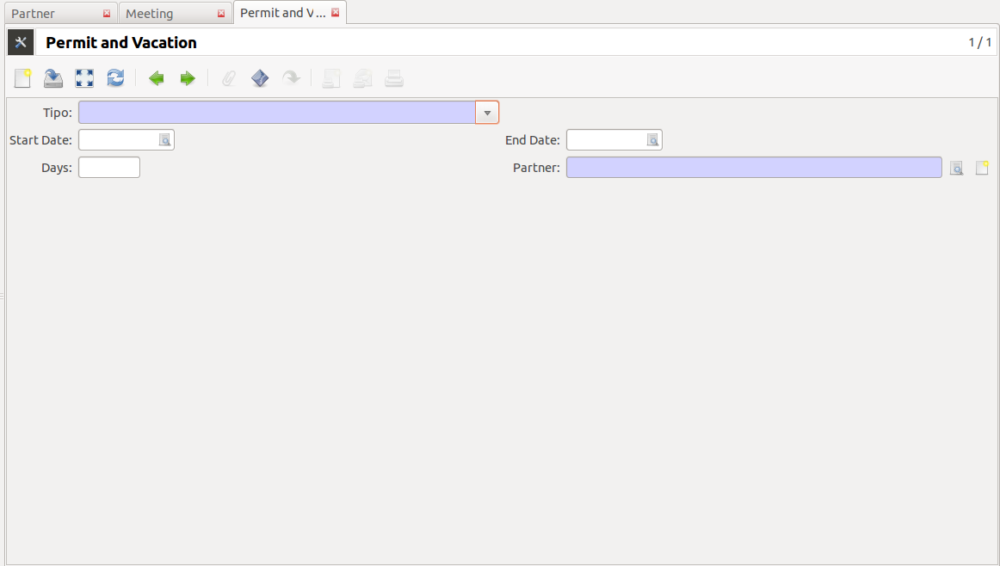
   
Permite cargar los días que tiene asignados ese socio (Días de vacaciones) y luego permite cargar un registro por cada licencia o vacación que el socio se tome. 

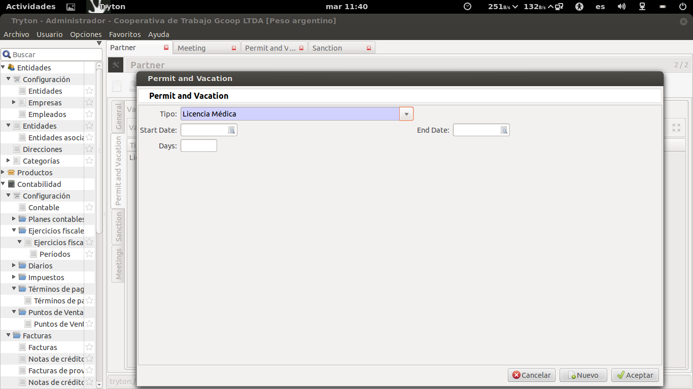

Sanciones
---------

Este módulo permite cargar sanciones a un socio con los Tipos que figuran en el Estatuto base de una Cooperativa de Trabajo: Llamado de Atención, Apercibimiento y Exclusión con el causante yel descargo presentado por el socio.
  
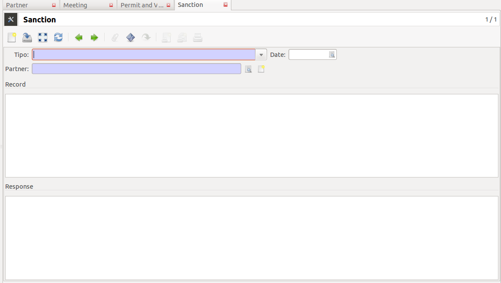

Reuniones
---------

Aqui se podrán cargar las Reuniones de Consejo y Asambleas que realiza la cooperativa, señalando los socios presentes y los temas tratados como área de texto o archivo adjunto (Tipos de Reunión: reunión de consejo, Asamblea 
Ordinaria o Extraordinaria).

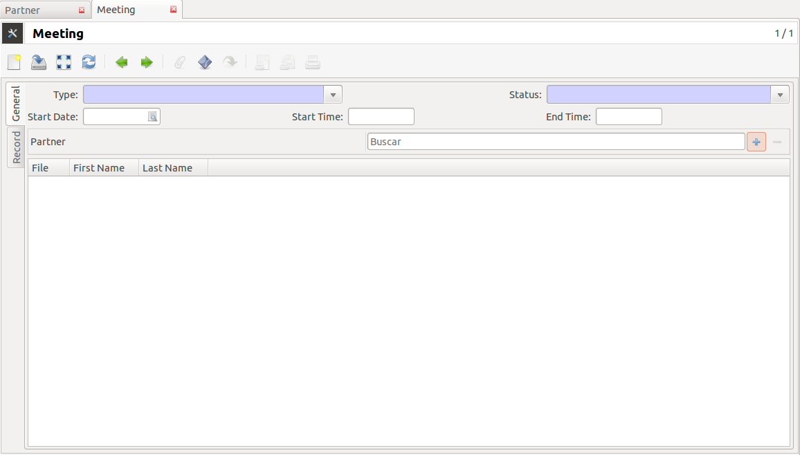

Desde el socio se puede buscar una REunión para señalar que el socio participó en la misma.

Recibos
-------

Permite crear el "Recibo de Anticipo de Retornos a Cuenta de Excedentes" que los socios de las cooperativas de trabajo reciben como prestación del trabajo que realizan.
Este módulo permite cargar el importe y la fecha del retiro y genera un Recibo con validez que pasa a estar inmutado una vez que está confirmado (tiene una secuencia propia de Recibos). El sistema toma los datos de al Cooperativa y del 
socio de forma automática para generar la impresión del recibo de forma correcta.
Al momento de confirmarse el Recibo, el mismo se inmuta y se generan los asientos contables necesarios. El recibo queda pendiente de pago (similar al workflow de factura). Una vez que el mismo se paga queda terminado el proceso y se realiza el Asiento correspondiente. 
